# Optimización de la Capa Semántica: Reducción de Deuda Técnica y Memoria

## 1. Metadatos

| Atributo            | Valor                                                                 |
|---------------------|-----------------------------------------------------------------------|
| **Duración**        | 90 minutos                                                            |
| **Complejidad**     | Media                                                                 |
| **Nivel Bloom**     | Crear                                                                 |
| **Módulo**          | Módulo 1 — Optimización Semántica Avanzada                            |
| **Herramientas**    | Power BI Desktop, DAX Studio, VertiPaq Analyzer, Power Query (M), DAX |
| **Archivo inicial** | `Lab01_VentasRetail_DeudaTecnica.pbix`                                |
| **Archivo final esperado** | `Lab01_VentasRetail_Optimizado.pbix`                          |

---

## 2. Descripción General

En este laboratorio recibirás un modelo semántico Power BI construido deliberadamente con deuda técnica: columnas calculadas innecesarias, medidas duplicadas, tipos de datos subóptimos, relaciones evitables y la opción *Auto date/time* activa. Utilizarás **DAX Studio** y **VertiPaq Analyzer** para diagnosticar y cuantificar cada problema, luego aplicarás un proceso estructurado de remediación en **Power Query**, el **editor de modelos** y el **editor DAX**. El laboratorio concluye con un benchmarking comparativo que valida una reducción de al menos el 30 % en el tamaño del modelo y una mejora medible en el tiempo de respuesta de consultas representativas.

---

## 3. Objetivos de Aprendizaje

Al finalizar este laboratorio serás capaz de:

- Identificar y cuantificar fuentes de deuda técnica (columnas de alta cardinalidad, medidas duplicadas, relaciones ineficientes) usando VertiPaq Analyzer y DMVs en DAX Studio.
- Aplicar técnicas de optimización de memoria en Power Query: conversión de tipos, eliminación de columnas y reducción de cardinalidad mediante dimensiones de referencia.
- Refactorizar medidas DAX redundantes en medidas base reutilizables utilizando `CALCULATE`, `DIVIDE` y variables `VAR`.
- Desactivar *Auto date/time* e implementar una dimensión de fechas única (`DimFecha`) para eliminar tablas ocultas redundantes.
- Validar el impacto de las optimizaciones comparando métricas de tamaño de modelo y rendimiento de consultas antes y después de cada intervención.

---

## 4. Antes de comenzar

Antes de iniciar, verifica que el entorno ya fue preparado siguiendo el archivo `SETUP.md`.

Debes tener disponible:

- Power BI Desktop.
- DAX Studio.
- VertiPaq Analyzer desde DAX Studio.
- Archivo inicial: `C:\LabPowerBI\Lab01\Lab01_VentasRetail_DeudaTecnica.pbix`.
- Carpeta para capturas: `C:\LabPowerBI\Lab01\Capturas`.
- Carpeta para archivos VPAX: `C:\LabPowerBI\Lab01\VPAX`.

No optimices el modelo antes de iniciar. El archivo inicial fue construido deliberadamente con deuda técnica para que puedas diagnosticarla y corregirla durante el laboratorio.

---

## 5. Escenario del laboratorio

En este laboratorio trabajarás con un modelo semántico de ventas retail que contiene problemas intencionales de diseño y optimización. Tu objetivo será diagnosticar esos problemas, aplicar mejoras y comparar el modelo antes y después de la intervención.

El modelo inicial contiene, entre otros elementos:

- Columnas calculadas materializadas en la tabla de hechos.
- Medidas DAX duplicadas o redundantes.
- Columnas de alta cardinalidad que no aportan valor analítico.
- Campos DateTime con granularidad innecesaria.
- Auto date/time activo.
- Relaciones many-to-many evitables.
- Relaciones bidireccionales sin justificación.
- Una dimensión de fechas que deberá quedar como referencia única para el análisis temporal.

Al finalizar, guardarás una versión optimizada del modelo y compararás métricas de memoria y rendimiento frente al estado inicial.

---

## 6. Instrucciones Paso a Paso

---

### Paso 1 — Diagnóstico inicial: exportar y analizar el VPAX

**Objetivo:** Establecer la línea base del modelo documentando tamaño total, columnas de mayor consumo y cardinalidades problemáticas antes de cualquier modificación.

1. Con el archivo `Lab01_VentasRetail_DeudaTecnica.pbix` abierto en Power BI Desktop, abre **DAX Studio**. El archivo se encuentra en `C:\LabPowerBI\Lab01\Lab01_VentasRetail_DeudaTecnica.pbix`.

2. En DAX Studio, conecta al modelo: menú **Home → Connect → PBI / SSDT Model** y selecciona `Lab01_VentasRetail_DeudaTecnica`.
   
   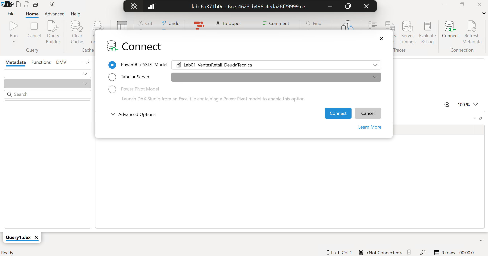

3. Exporta el VPAX: menú **Advanced → Export Metrics (VertiPaq Analyzer)**. Guarda el archivo como:
   ```
   C:\LabPowerBI\Lab01\VPAX\Lab01_ANTES.vpax
   ```
   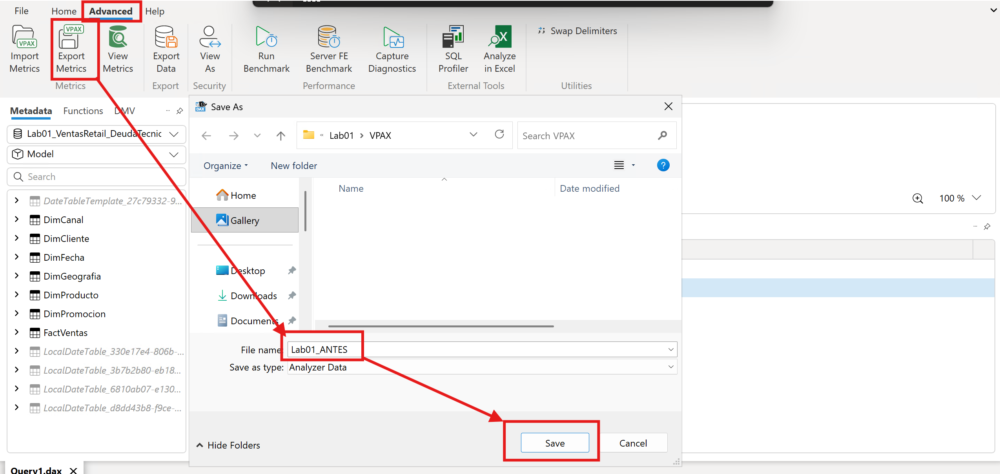

4. Abre VertiPaq Analyzer: menú **Advanced → View Metrics** (si no se abre automáticamente, abre el archivo `.vpax` guardado).

   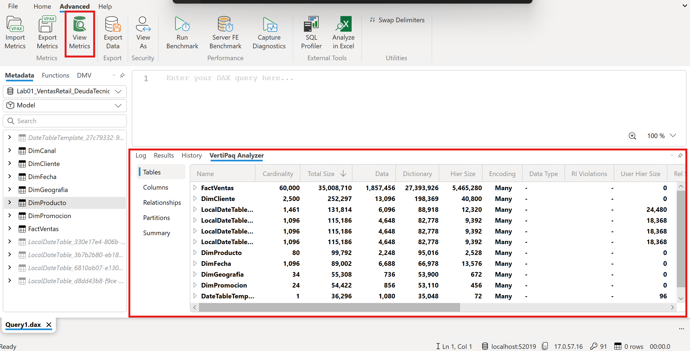

5. En la pestaña **Summary**, registra en tu bitácora (En un archivo de Excel) los siguientes valores:

   | Métrica                        | Valor inicial |
   |------------------------------- |---------------|
   | Tamaño total del modelo (MiB)  | ___________   |
   | Número de tablas               | ___________   |
   | Número de columnas total       | ___________   |
   | Número de columnas calculadas  | ___________   |

   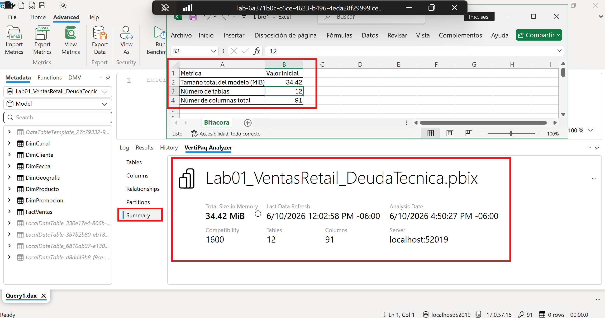

6. En la pestaña **Columns**, ordena por **Total Size** (descendente). Identifica y anota las **5 columnas de mayor tamaño**:

   | Tabla            | Columna              | Cardinalidad | Tipo de dato | Tamaño (B) |
   |------------------|----------------------|--------------|--------------|-------------|
   | ___________      | ___________          | ___________  | ___________  | ___________ |
   | ___________      | ___________          | ___________  | ___________  | ___________ |
   | ___________      | ___________          | ___________  | ___________  | ___________ |
   | ___________      | ___________          | ___________  | ___________  | ___________ |
   | ___________      | ___________          | ___________  | ___________  | ___________ |

      
   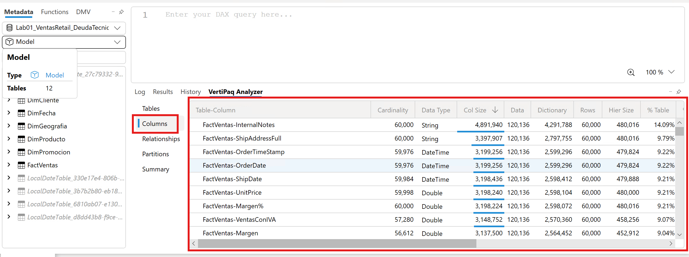

7. Ejecuta la siguiente consulta DMV en DAX Studio para identificar columnas calculadas materializadas, registra la información en la bitácora:

   | Tabla            | Columna calculada   | Expresión DAX     | Tipo de columna |
   |------------------|---------------------|-------------------|-----------------|
   | ___________      | ___________         | ___________       | ___________     |
   | ___________      | ___________         | ___________       | ___________     |
   | ___________      | ___________         | ___________       | ___________     |

   ```DAX
   SELECT
      [TableID],
      [ExplicitName],
      [Expression],
      [Type]
   FROM $SYSTEM.TMSCHEMA_COLUMNS
   WHERE [TableID] = 19

   ```
   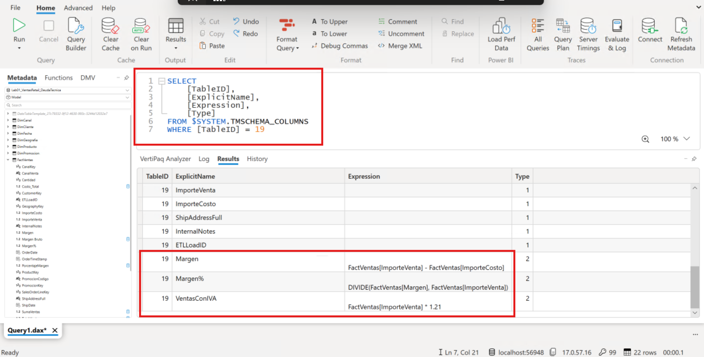


8. Ejecuta la siguiente consulta DMV en DAX Studio para identificar medidas con lógica potencialmente duplicada:

   ```DAX
   SELECT
      [MEASUREGROUP_NAME] AS [Tabla],
      [MEASURE_NAME] AS [Medida],
      [EXPRESSION] AS [Expresion DAX],
      [MEASURE_IS_VISIBLE] AS [Visible]
   FROM $SYSTEM.MDSCHEMA_MEASURES

   ```
   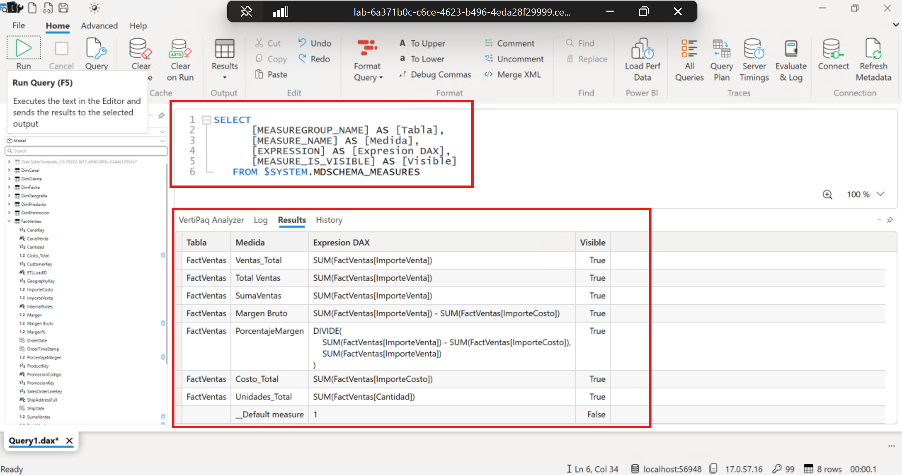

9. Revisa las filas visibles y localiza medidas que calculen lo mismo con nombres diferentes o expresiones equivalentes. En este modelo deberías encontrar medidas como `Ventas_Total`, `Total Ventas`, `SumaVentas`, `Margen Bruto` y `PorcentajeMargen`. registra la información en la bitácora:

      | Tabla            | Medida              | Expresión DAX     | Observación     |
      |------------------|---------------------|-------------------|-----------------|
      | ___________      | ___________         | ___________       | ___________     |
      | ___________      | ___________         | ___________       | ___________     |
      | ___________      | ___________         | ___________       | ___________     |

   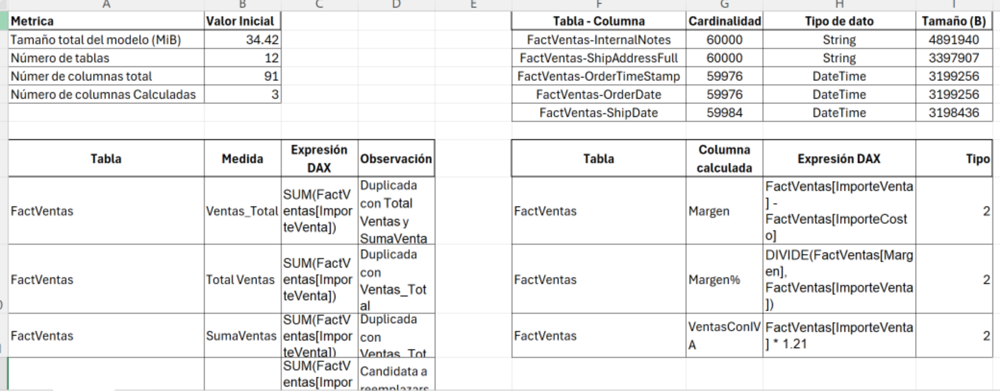

10. **Ejecutar consultas de benchmark:** En DAX Studio, ejecuta las siguientes consultas de benchmark. Para cada una, usa **Query → Run** y registra el tiempo de **Server Timings** en la bitácora (habilita con **Home → Server Timings**).

      **Consulta de benchmark 1 — Ventas por categoría y año:**

      ```DAX
      EVALUATE 
         SUMMARIZECOLUMNS(
            DimProducto[Category], 
            DimFecha[Year], 
            "Ventas", [Ventas_Total], 
            "Margen", [Margen Bruto], 
            "Margen %", [PorcentajeMargen] 
      )
      ```
      Revisa el panel **Server Timings** y registra el tiempo total (Total ms) en la bitácora.

      **Consulta de benchmark 2 — Top 10 clientes por ventas:**

      ```DAX
      EVALUATE 
         TOPN( 
            10, 
            SUMMARIZECOLUMNS( 
               DimCliente[CustomerName], 
               "Ventas", [SumaVentas] 
            ), 
            [Ventas], DESC
         )
      ```
      Revisa el panel **Server Timings** y registra el tiempo total (Total ms) en la bitácora.

      **Consulta de benchmark 3 — Ventas mensuales del último año:**

         ```DAX
         CALCULATETABLE( 
            SUMMARIZECOLUMNS( 
               DimFecha[Year], 
               DimFecha[MonthNumber], 
               DimFecha[MonthName], 
               "Ventas", [Total Ventas], 
               "Unidades", [Unidades_Total] 
            ), 
            DimFecha[Year] = YEAR(TODAY()) - 1 
         )
         
         ```

      Revisa el panel **Server Timings** y registra el tiempo total (Total ms) en la bitácora.

      Registra los tiempos en tu bitácora:

      | Consulta       | Tiempo (ms)
      |----------------|-------------------|
      | Benchmark 1    | ___________       |
      | Benchmark 2    | ___________       |
      | Benchmark 3    | ___________       |

11. Toma una captura de pantalla de la pestaña **Summary** de VertiPaq Analyzer y guárdala como:
    ```
    C:\LabPowerBI\Lab01\Capturas\01_VertiPaq_ANTES_Summary.png
    ```

### Resultado Esperado

- Archivo `Lab01_ANTES.vpax` guardado correctamente.
- Bitácora con tamaño inicial del modelo, top 5 columnas por consumo y lista de medidas potencialmente duplicadas.


---

### Paso 2 — Optimización en Power Query: tipos de datos y eliminación de columnas

**Objetivo:** Reducir el tamaño del modelo eliminando columnas no utilizadas y convirtiendo tipos de datos subóptimos directamente en la capa de ingesta (Power Query), aplicando las transformaciones antes de que VertiPaq materialice los datos.

1. En Power BI Desktop, abre el **Editor de Power Query**: menú **Inicio → Transformar datos**.

2. **Eliminar columnas no utilizadas en visualizaciones:**

   Selecciona la tabla `FactVentas`. Identifica las siguientes columnas que no aparecen en ningún visual ni son usadas por medidas:
   - `OrderTimeStamp` (DateTime completo — la hora no se usa)
   - `ShipAddressFull` (texto concatenado de alta cardinalidad)
   - `InternalNotes` (texto libre, cardinalidad muy alta)
   - `ETLLoadID` (clave técnica de ETL, no de negocio)

   Para eliminarlas, haz clic derecho sobre cada columna → **Quitar columnas**. Alternativamente, usa el editor avanzado para agregar este paso en M:

   ```m
   #"Columnas eliminadas" = Table.RemoveColumns(
       #"Paso anterior",
       {"OrderTimeStamp", "ShipAddressFull", "InternalNotes", "ETLLoadID"}
   )
   ```

3. **Convertir DateTime a Date (reducir cardinalidad):**

   En la tabla `FactVentas`, localiza la columna `OrderDate` que tiene tipo `datetime`. Convierte a `date`:

   ```m
   #"OrderDate a Date" = Table.TransformColumns(
       #"Columnas eliminadas",
       {{"OrderDate", DateTime.Date, type date}}
   )
   ```

   Repite para `ShipDate` si también es datetime.

4. **Redondear decimales a precisión de negocio:**

   La columna `UnitPrice` tiene 6 decimales. El negocio trabaja con 2 decimales:

   ```m
   #"UnitPrice redondeado" = Table.TransformColumns(
       #"OrderDate a Date",
       {{"UnitPrice", each Number.Round(_, 2), type number}}
   )
   ```

5. **Convertir columna de texto a clave entera (DimCanal):**

   La tabla `FactVentas` contiene la columna `CanalVenta` (texto: "Online", "Tienda Física", "Distribuidor", etc.) con cardinalidad moderada pero repetida en millones de filas.

   a. Selecciona la tabla `DimCanal` (ya existe en el modelo). Verifica que tiene las columnas `CanalKey` (entero) y `CanalVenta` (texto).

   b. En la tabla `FactVentas`, verifica que existe la columna `CanalKey` (entero). Si la columna `CanalVenta` texto **también** existe en `FactVentas`, elimínala:

   ```m
   #"CanalVenta texto eliminado" = Table.RemoveColumns(
       #"UnitPrice redondeado",
       {"CanalVenta"}
   )
   ```


6. **Verificar tipos de datos en todas las tablas de dimensiones:**

   Revisa `DimProducto`, `DimCliente` y `DimGeografia`. Para cada columna de clave (terminada en `Key` o `ID`), asegúrate de que el tipo sea **Número entero** (`Int64.Type`), no texto. Corrige los que sean incorrectos:

   ```m
   #"Tipos corregidos DimProducto" = Table.TransformColumnTypes(
       Source,
       {
           {"ProductKey",  Int64.Type},
           {"CategoryKey", Int64.Type},
           {"SubcategoryKey", Int64.Type}
       }
   )
   ```

7. Haz clic en **Cerrar y aplicar**. Espera a que el modelo se recargue.

   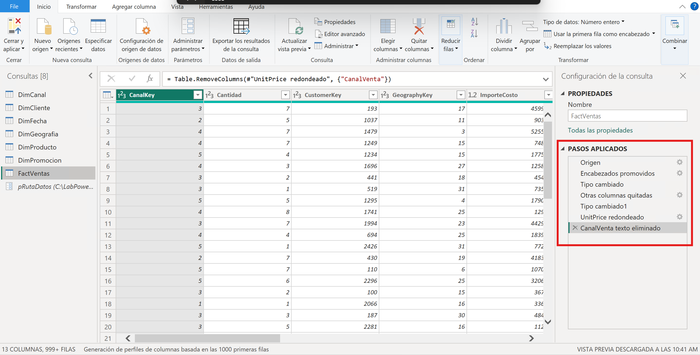
   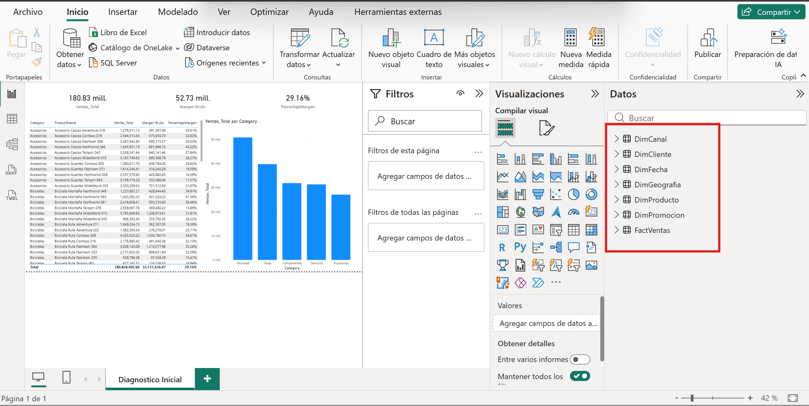

### Resultado Esperado

- La tabla `FactVentas` no contiene las columnas `OrderTimeStamp`, `ShipAddressFull`, `InternalNotes`, `ETLLoadID` ni `CanalVenta` (texto).
- `OrderDate` y `ShipDate` son de tipo `date`, no `datetime`.
- `UnitPrice` tiene máximo 2 decimales.
- Todas las columnas `*Key` e `*ID` son de tipo entero en todas las tablas.

---

### Paso 3 — Optimización del modelo: relaciones, Auto date/time y DimFecha

**Objetivo:** Eliminar relaciones innecesarias o ineficientes, desactivar *Auto date/time* para suprimir tablas de fecha ocultas redundantes, y validar que la `DimFecha` única está correctamente configurada.

1. **Desactivar Auto date/time en el archivo actual:**

   En Power BI Desktop: **Archivo → Opciones y configuración → Opciones → pestaña "Archivo actual" → Carga de datos** → desmarcar **"Fecha y hora automáticas"**.

   Haz clic en **Aceptar** y espera a que el modelo se actualice. Esta acción puede tardar unos segundos mientras Power BI elimina las tablas de fecha generadas automáticamente.

      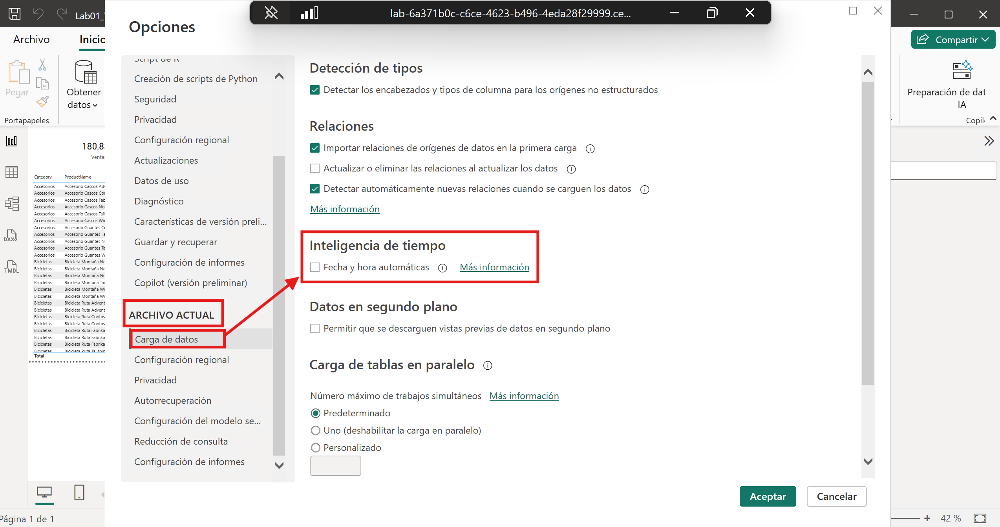

2. **Verificar eliminación de tablas de fecha ocultas:**

   En DAX Studio, ejecuta la siguiente consulta DMV:

   ```DAX
   SELECT
      [Name],
      [IsPrivate]
   FROM $SYSTEM.TMSCHEMA_TABLES

   ```
   
   Revisa los resultados, localiza la columna "IsPrivate" si hay un valor "TRUE" son las tablas ocultas de fecha generadas por Auto date/time. Con la opción desactivada, estas tablas deben desaparecer o reducirse significativamente. Si hay valores "False", son tablas visibles del modelo, como `DimFecha`, `DimProducto`, etc.
   
      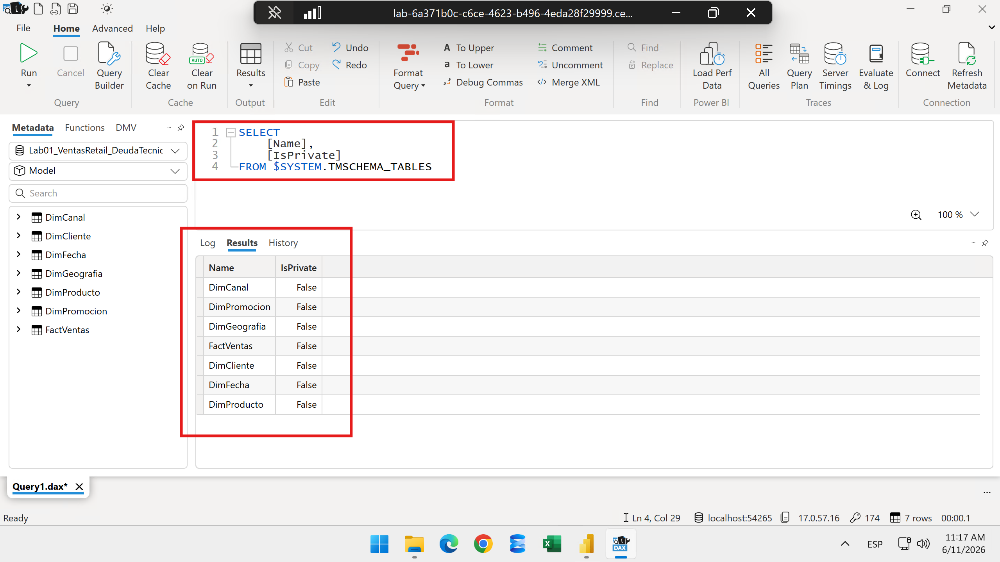

3. **Revisar y corregir relaciones Many-to-Many evitables:**

   En la vista de **Modelo** de Power BI Desktop, identifica relaciones marcadas con el símbolo `*` en ambos extremos (Many-to-Many). El modelo semántico de práctica tiene una relación M:M entre `FactVentas` y `DimPromocion` basada en la columna `PromocionCodigo` (texto). Esta relación es ineficiente y debe ser corregida a una relación Many-to-One con clave entera.

   Esta relación existe porque `FactVentas` tiene una columna `PromocionCodigo` (texto) que no es única en `DimPromocion`. Solución:

   a. Eliminar relación M:M actual entre `FactVentas` y `DimPromocion`.

   b. Crea una nueva relación: `FactVentas[PromocionKey] → DimPromocion[PromocionKey]` (Many-to-One, dirección de filtro única: de dimensión a hecho).

   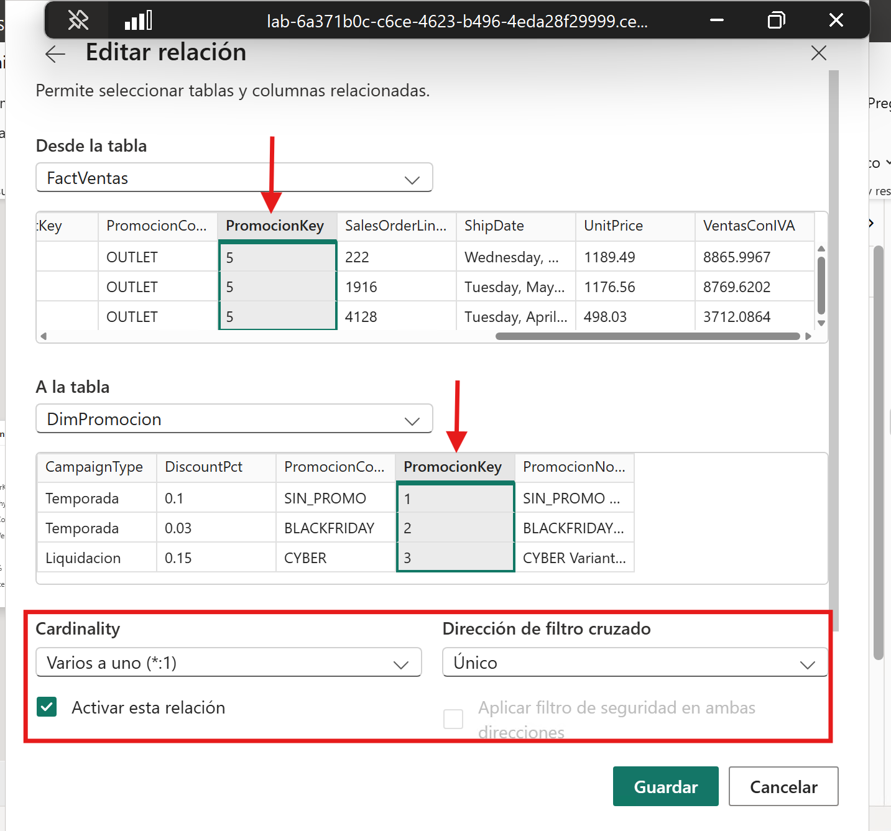

4. **Verificar relaciones bidireccionales innecesarias:**

   En la vista de Modelo, identifica relaciones con dirección de filtro **Ambas** (bidireccional). Evalúa cada una:
   - Si la bidireccionalidad es necesaria para la lógica de negocio (p. ej., rol de seguridad), consérvala documentada.
   - Si fue configurada "por defecto" sin análisis, cámbiala a **Dirección única** (de dimensión a hecho).

   En el modelo semántico de práctica, la relación `DimGeografia ↔ DimCliente` es bidireccional sin justificación. Cámbiala a dirección única: `DimGeografia → DimCliente`.


5. **Validar DimFecha:**

   Confirma que la tabla `DimFecha` contiene al menos las columnas:
   - `DateKey` (entero, formato YYYYMMDD — clave de relación)
   - `Date` (tipo date)
   - `Year` (entero)
   - `QuarterNumber` (entero)
   - `MonthNumber` (entero)
   - `MonthName` (texto — cardinalidad 12)
   - `DayOfWeek` (entero)
   - `IsWeekend` (booleano)

   > ✅ **Buena práctica:** Evita columnas concatenadas como `"2024-Q1"` o `"Ene 2024"` como texto. Usa columnas separadas y define jerarquías en el modelo.

   Verifica que `FactVentas[OrderDate]` tiene una relación activa con `DimFecha[Date]`. Si `FactVentas[OrderDate]` no está relacionado con `DimFecha`, crea la relación: `FactVentas[OrderDate] → DimFecha[Date]` (Many-to-One, dirección de filtro única).

    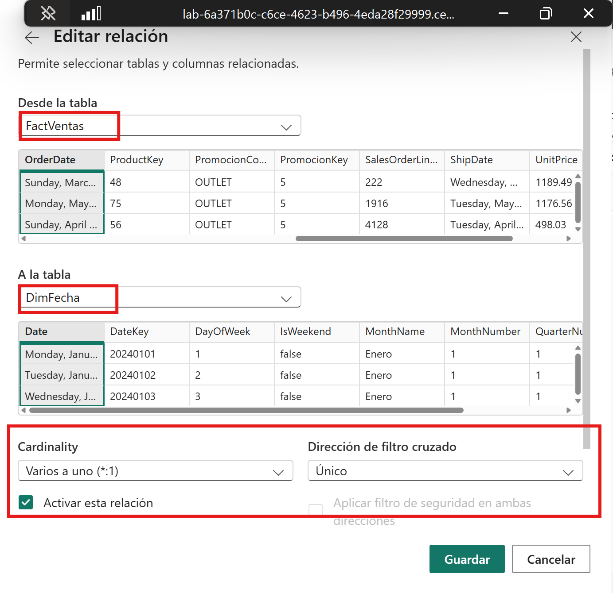

6. Eliminar relación entre `FactVentas[GeographyKey]` y `DimGeografia[GeographyKey]` si existe, ya que el análisis geográfico se realizará a través de `DimCliente` y no directamente desde el hecho.

   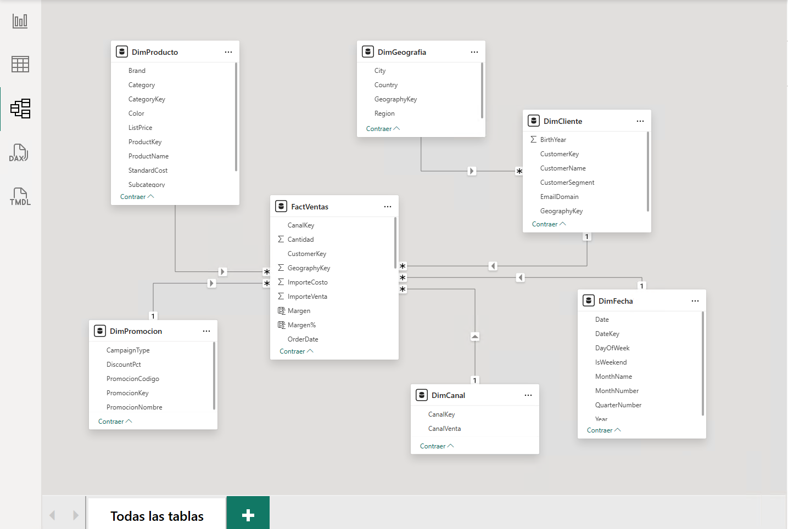

7. Guarda el archivo: **Ctrl + S**.

### Resultado Esperado

- *Auto date/time* desactivado; las tablas privadas de fecha ya no aparecen en la consulta DMV.
- La relación `FactVentas ↔ DimPromocion` es Many-to-One con dirección de filtro única.
- La relación `DimGeografia ↔ DimCliente` tiene dirección única.
- `DimFecha` está correctamente relacionada con `FactVentas[OrderDate]`.
- Se eliminan relaciones innecesarias entre `FactVentas` y `DimGeografia`.

---

### Paso 4 — Refactorización DAX: eliminar columnas calculadas y consolidar medidas

**Objetivo:** Convertir columnas calculadas materializadas en medidas calculadas a demanda, y consolidar medidas redundantes en un conjunto de medidas base reutilizables con convenciones de nomenclatura claras.

1. **Identificar y eliminar columnas calculadas innecesarias:**

   En la vista de **Tabla** de Power BI Desktop, navega a la tabla `FactVentas`. Identifica las siguientes columnas calculadas (icono de función `fx`):
   - `Margen` = `FactVentas[ImporteVenta] - FactVentas[ImporteCosto]`
   - `Margen%` = `DIVIDE(FactVentas[Margen], FactVentas[ImporteVenta])`
   - `VentasConIVA` = `FactVentas[ImporteVenta] * 1.21`

   Estas columnas se materializan fila por fila y ocupan memoria. Deben convertirse en medidas.

   Para eliminar cada columna calculada: selecciona la columna → clic derecho → **Eliminar columna**. Confirma la eliminación.

2. **Crear tabla de medidas centralizada:**

   Crea una tabla vacía dedicada a medidas (buena práctica de organización):

   En Power BI Desktop: **Vista de Tabla → Herramientas de tablas → Nueva tabla**:

   ```DAX
   _Medidas = DATATABLE("Placeholder", STRING, {{""}})
   ```

   Oculta la columna `Placeholder`: clic derecho sobre la columna → **Ocultar en vista de informe**.

   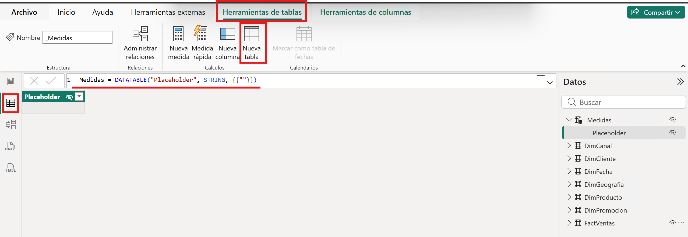

3. **Crear medidas base reutilizables:**

   En la tabla `_Medidas`, crea las siguientes medidas. Usa **Modelado → Nueva medida**:

   ```DAX
   Ventas =
   SUM(FactVentas[ImporteVenta])
   ```

   ```DAX
   Costo =
   SUM(FactVentas[ImporteCosto])
   ```

   ```DAX
   Unidades =
   SUM(FactVentas[Cantidad])
   ```

4. **Crear medidas derivadas que referencian las medidas base:**

   ```DAX
   Margen =
   [Ventas] - [Costo]
   ```

   ```DAX
   Margen % =
   DIVIDE([Margen], [Ventas], 0)
   ```

   ```DAX
   Ventas Con IVA =
   VAR _tasaIVA = 0.21
   RETURN
       [Ventas] * (1 + _tasaIVA)
   ```

   ```DAX
   Ticket Promedio =
   DIVIDE([Ventas], [Unidades], 0)
   ```
   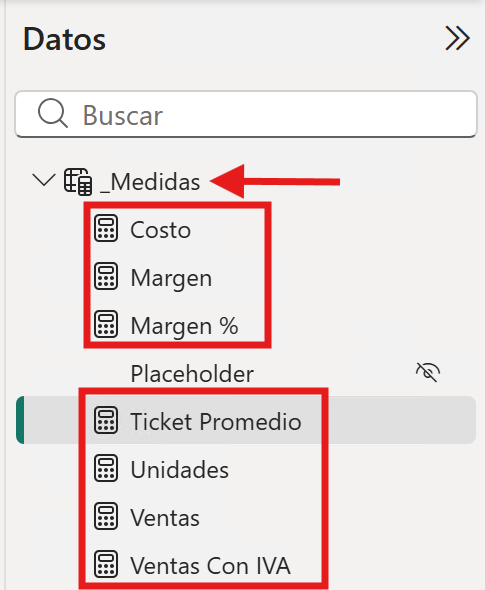

5. **Identificar y eliminar medidas duplicadas:**

   Basándote en la lista obtenida en el Paso 1 (Ir a Bitacora) localiza las medidas redundantes. Estas medidas calculan lo mismo que las medidas base o derivadas que acabas de crear, pero con nombres diferentes o expresiones equivalentes. Por ejemplo:
   - `Ventas_Total` (equivalente a `Ventas`)
   - `Total Ventas` (equivalente a `Ventas`)
   - `SumaVentas` (equivalente a `Ventas`)
   - `Margen Bruto` (equivalente a `Margen`)
   - `PorcentajeMargen` (equivalente a `Margen %`)
   - `Costo_Total` (equivalente a `Costo`)

   Para cada medida redundante: selecciona la medida en el panel de campos → clic derecho → **Eliminar del modelo**.

   > **Antes de eliminar:** Verifica en la vista de **Informe** que ningún visual usa la medida redundante. Si algún visual la usa, actualiza el visual para usar la medida base equivalente antes de eliminar.

   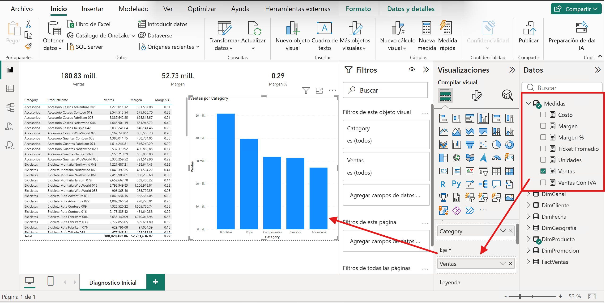

6. **Organizar medidas en carpetas de visualización:**

   Selecciona cada medida en el panel de Datos. En la vista **Modelo**, en el panel de **Propiedades** (panel derecho), asigna la carpeta de visualización:

   | Medida           | Carpeta de visualización |
   |------------------|--------------------------|
   | `Ventas`         | `Ventas\Base`            |
   | `Costo`          | `Ventas\Base`            |
   | `Unidades`       | `Ventas\Base`            |
   | `Margen`         | `Rentabilidad`           |
   | `Margen %`       | `Rentabilidad`           |
   | `Ventas Con IVA` | `Ventas\Derivadas`       |
   | `Ticket Promedio`| `Ventas\Derivadas`       |

   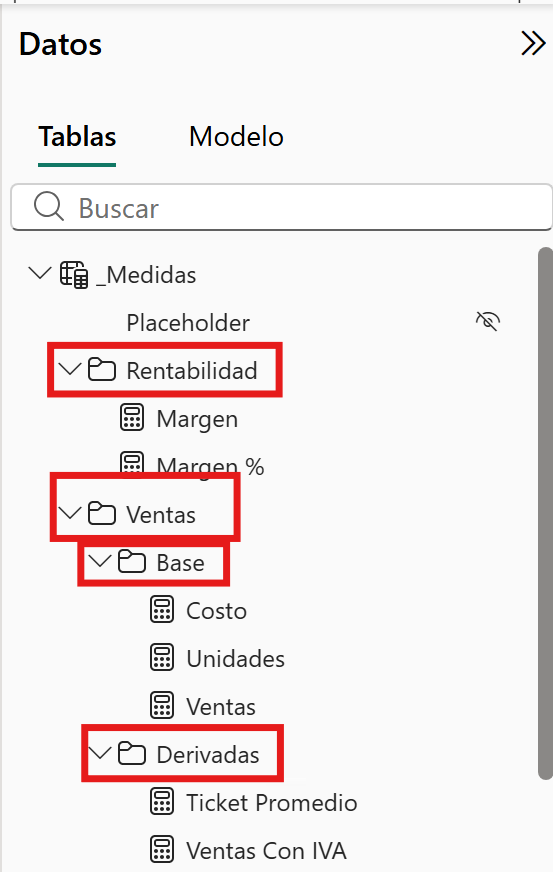

7. **Ocultar columnas técnicas:**

   En la vista de Modelo, oculta las siguientes columnas (clic derecho → **Ocultar en vista de informe**):
   - Todas las columnas `*Key` e `*ID` en tablas de hechos y dimensiones.
   - La columna `Placeholder` de la tabla `_Medidas`.
   - Columnas de ordenación (p. ej., `MonthNumber` si se usa solo para ordenar `MonthName`).

8. Guarda el archivo: **Ctrl + S**.

### Resultado Esperado

- Las columnas calculadas `Margen`, `Margen%` y `VentasConIVA` ya no existen en `FactVentas`.
- Existe la tabla `_Medidas` con al menos 7 medidas organizadas en carpetas.
- Las medidas redundantes (`Ventas_Total`, `Total Ventas`, `SumaVentas`, `Margen Bruto`, `PorcentajeMargen`) han sido eliminadas.
- Las columnas técnicas están ocultas en la vista de informe.

---

### Paso 5 — Benchmarking comparativo: antes vs. después

**Objetivo:** Cuantificar el impacto total de las optimizaciones aplicadas exportando un nuevo VPAX, comparando métricas de tamaño y ejecutando consultas de benchmark para medir la mejora en tiempo de respuesta.

1. **Exportar VPAX del modelo optimizado:**

   En DAX Studio (reconecta al modelo actualizado si es necesario): **Advanced → Export Metrics (VertiPaq Analyzer)**. Guarda como:
   ```
   C:\LabPowerBI\Lab01\VPAX\Lab01_DESPUES.vpax
   ```

2. **Comparar métricas de tamaño:**

   En la bitacora complementa la tabla comparativa con los valores del modelo optimizado (después):

   | Métrica                           | Valor Inicial        | Valor Después      | Reducción (%) |
   |-----------------------------------|--------------|--------------|---------------|
   | Tamaño total del modelo (MiB)      | ___________  | ___________  | ___________   |
   | Número de tablas                   | ___________  | ___________  | ___________   |
   | Número de columnas total     | ___________  | ___________  | ___________   |
   | Número de Columnas Calculadas                | ___________  | ___________  | ___________   |
   

   > **Meta:** Reducción de tamaño total ≥ 30 %. Si no se alcanza, revisa si quedan columnas calculadas o si *Auto date/time* fue desactivado correctamente en el archivo actual.

   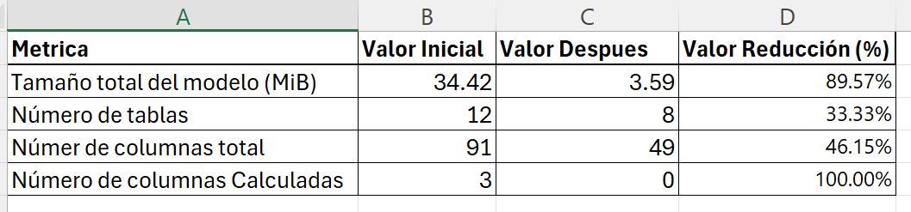

3. **Ejecutar consultas de benchmark:**

   En DAX Studio, ejecuta las siguientes consultas de benchmark. Para cada una, usa **Query → Run** y registra el tiempo de **Server Timings** en la bitácora (habilita con **Home → Server Timings**).

   **Consulta de benchmark 1 — Ventas por categoría y año:**
   ```DAX
   EVALUATE
   SUMMARIZECOLUMNS(
       DimProducto[Category],
       DimFecha[Year],
       "Ventas",    [Ventas],
       "Margen",    [Margen],
       "Margen %",  [Margen %]
   )
   
   ```

   Revisa el panel **Server Timings** y registra el tiempo total (Total ms) en la bitácora.

   **Consulta de benchmark 2 — Top 10 clientes por ventas:**
   ```DAX
   EVALUATE
   TOPN(
       10,
       SUMMARIZECOLUMNS(
           DimCliente[CustomerName],
           "Ventas", [Ventas]
       ),
       [Ventas], DESC
   )
   ```

   Revisa el panel **Server Timings** y registra el tiempo total (Total ms) en la bitácora.

   **Consulta de benchmark 3 — Ventas mensuales del último año:**

   ```DAX
   EVALUATE
      CALCULATETABLE(
         SUMMARIZECOLUMNS(
            DimFecha[Year],
            DimFecha[MonthNumber],
            DimFecha[MonthName],
            "Ventas", [Ventas],
            "Unidades", [Unidades]
         ),
         DimFecha[Year] = YEAR(TODAY()) - 1
      )
   
   ```

   Revisa el panel **Server Timings** y registra el tiempo total (Total ms) en la bitácora.
   
   Registra los tiempos en tu bitácora:

   | Consulta       | Tiempo ANTES (ms) | Tiempo DESPUÉS (ms) | Mejora (%) |
   |----------------|-------------------|---------------------|------------|
   | Benchmark 1    | ___________       | ___________         | ___________|
   | Benchmark 2    | ___________       | ___________         | ___________|
   | Benchmark 3    | ___________       | ___________         | ___________|

   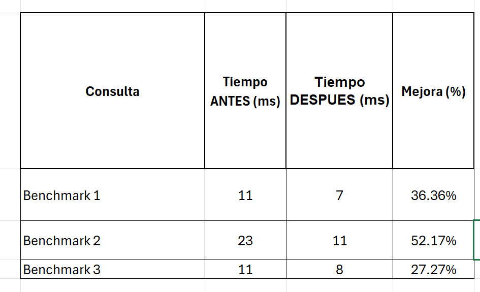
  

### Resultado Esperado

- Archivo `Lab01_DESPUES.vpax` guardado.
- Tabla comparativa completa en la bitácora con reducción ≥ 30 % en tamaño total.
- Las tres consultas de benchmark muestran tiempos iguales o menores al estado inicial.

---

### Lista de verificación de completitud

| # | Verificación                                                                 | Estado |
|---|------------------------------------------------------------------------------|--------|
| 1 | Archivo `Lab01_ANTES.vpax` existe en `C:\LabPowerBI\Lab01\VPAX\`            | ☐      |
| 2 | Archivo `Lab01_DESPUES.vpax` existe en `C:\LabPowerBI\Lab01\VPAX\`          | ☐      |
| 3 | Reducción de tamaño de modelo ≥ 30 %                                         | ☐      |
| 4 | *Auto date/time* desactivado — sin tablas privadas en consulta DMV           | ☐      |
| 5 | Columnas calculadas `Margen`, `Margen%`, `VentasConIVA` eliminadas de `FactVentas` | ☐ |
| 6 | Medidas redundantes eliminadas (mínimo 5 medidas duplicadas removidas)       | ☐      |
| 7 | Tabla `_Medidas` con carpetas de visualización configuradas                  | ☐      |
| 8 | Relación `FactVentas ↔ DimPromocion` es Many-to-One (no M:M)                | ☐      |
| 9 | Relación `DimGeografia ↔ DimCliente` tiene dirección de filtro única         | ☐      |
| 10| Consultas de benchmark ejecutadas con tiempos registrados                    | ☐      |

---

## Cierre del laboratorio

Antes de cerrar, conserva los siguientes archivos: los necesitarás como punto de partida para el **Lab 02**.

- `C:\LabPowerBI\Lab01\Lab01_VentasRetail_DeudaTecnica.pbix` ← entrada del Lab 02
- `C:\LabPowerBI\Lab01\VPAX\Lab01_ANTES.vpax`
- `C:\LabPowerBI\Lab01\VPAX\Lab01_DESPUES.vpax`


### Lo que aprendiste en este laboratorio

En este laboratorio aplicaste un proceso completo de diagnóstico y remediación de deuda técnica en un modelo semántico Power BI:

1. **Diagnóstico con VertiPaq Analyzer y DMVs:** Aprendiste a exportar un archivo VPAX y a interpretar las métricas de tamaño, cardinalidad y columnas calculadas para priorizar intervenciones con impacto real.

2. **Optimización en Power Query:** Aplicaste las transformaciones en el origen correcto — la capa de ingesta — para que VertiPaq nunca materialice datos innecesarios: eliminación de columnas, conversión de DateTime a Date, redondeo de decimales y sustitución de texto por claves enteras.

3. **Gobernanza del modelo:** Desactivaste *Auto date/time*, corregiste relaciones M:M y bidireccionales innecesarias, y validaste la integridad de la `DimFecha` única — tres acciones con alto impacto en tamaño y claridad semántica.

4. **Refactorización DAX:** Convertiste columnas calculadas materializadas en medidas calculadas a demanda, consolidaste medidas redundantes en medidas base con `CALCULATE`, `DIVIDE` y `VAR`, y organizaste el modelo con carpetas de visualización y convenciones de nomenclatura.

5. **Benchmarking comparativo:** Cuantificaste el impacto de cada optimización con métricas objetivas (tamaño VPAX y tiempos de consulta), estableciendo la práctica de medir antes y después como estándar de trabajo.

---

### Recursos de referencia

| Recurso | URL |
|---------|-----|
| Técnicas de reducción de datos para modelos Import en Power BI | https://learn.microsoft.com/power-bi/guidance/import-modeling-data-reduction |
| Diseño de esquema estrella para Power BI | https://learn.microsoft.com/power-bi/guidance/star-schema |
| VertiPaq (almacenamiento columnar) en Analysis Services | https://learn.microsoft.com/analysis-services/tabular/vertipaq |
| Auto date/time en Power BI Desktop | https://learn.microsoft.com/power-bi/transform-model/desktop-auto-date-time |
| Agregaciones avanzadas en Power BI | https://learn.microsoft.com/power-bi/transform-model/aggregations-advanced |
| VertiPaq Analyzer (SQLBI) | https://www.sqlbi.com/tools/vertipaq-analyzer/ |
| Optimizing DAX (SQLBI) | https://www.sqlbi.com/articles/optimizing-dax/ |

