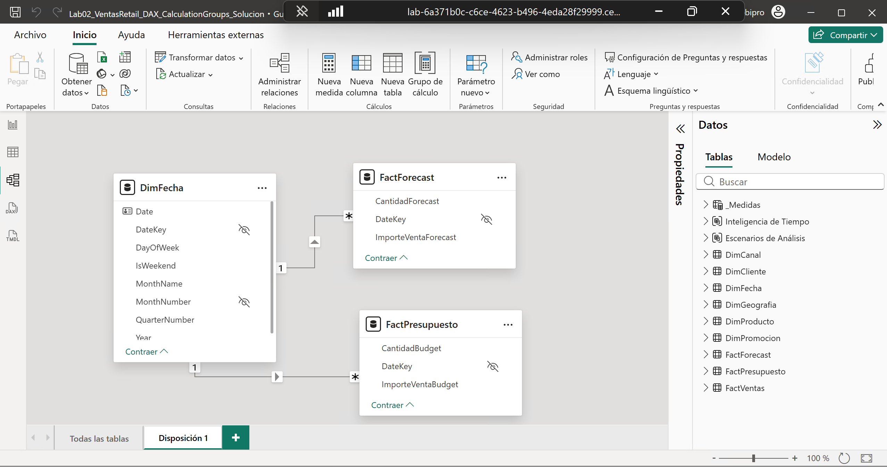
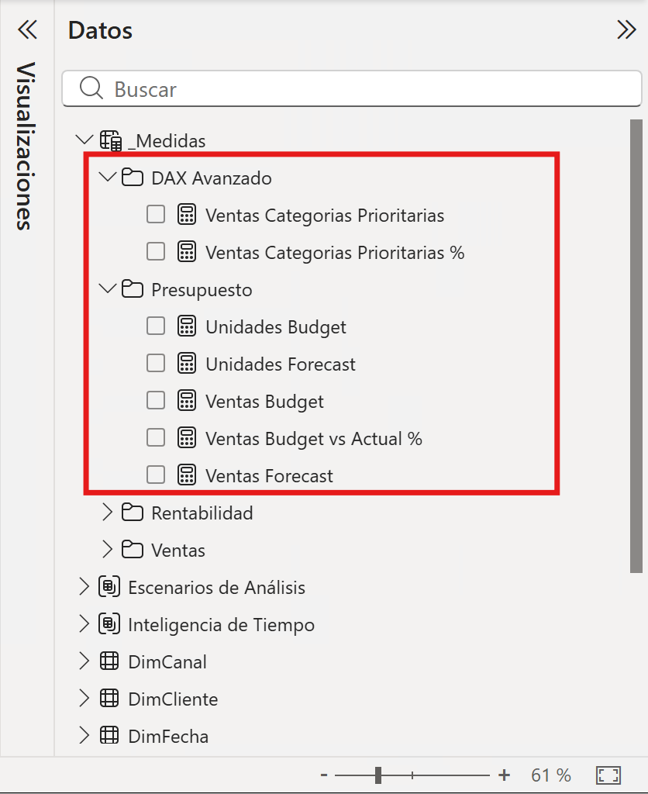
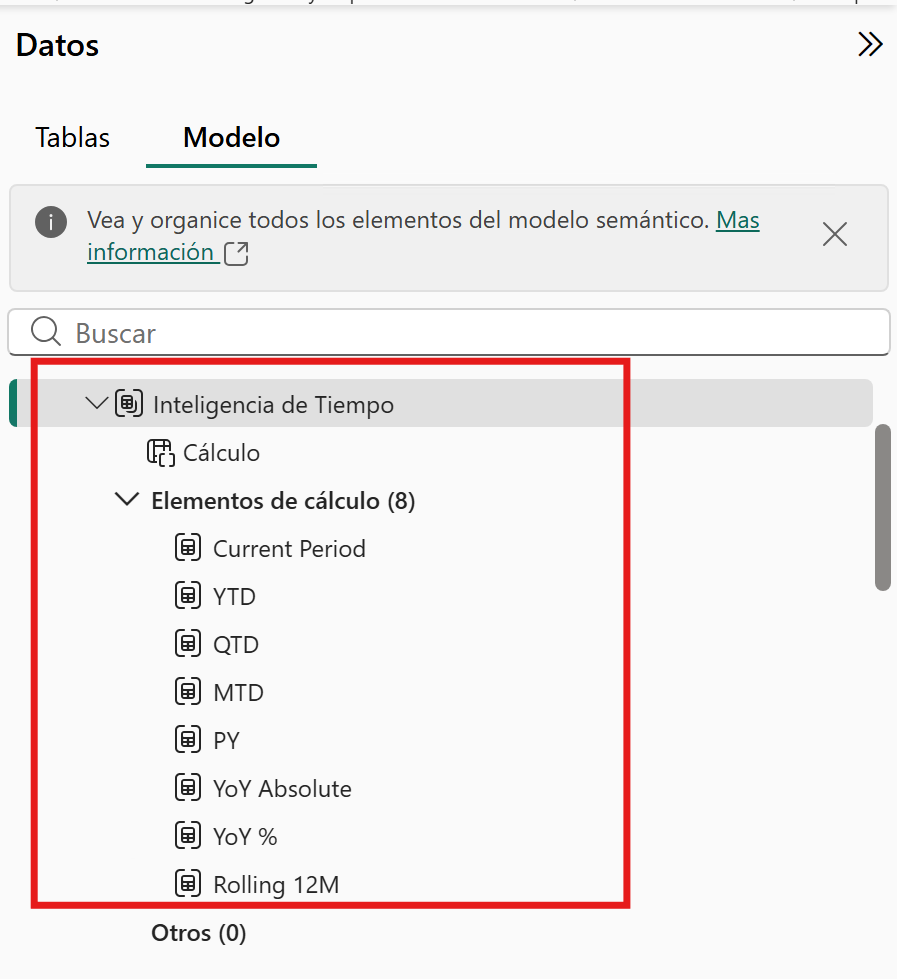
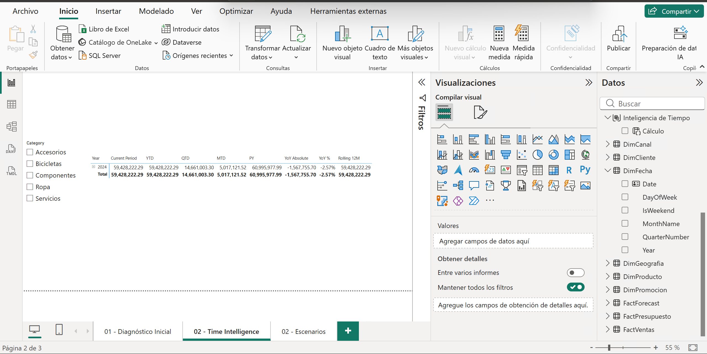
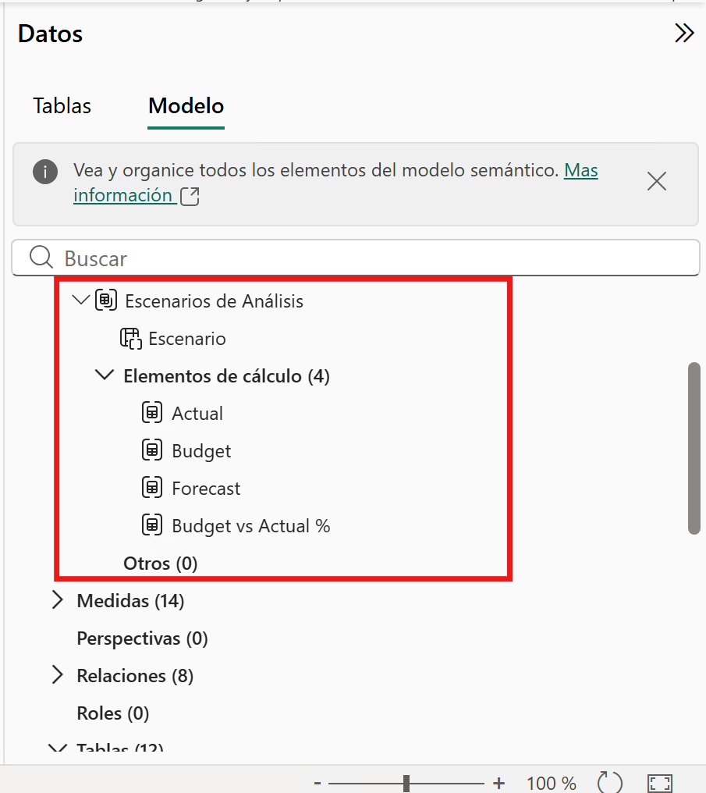
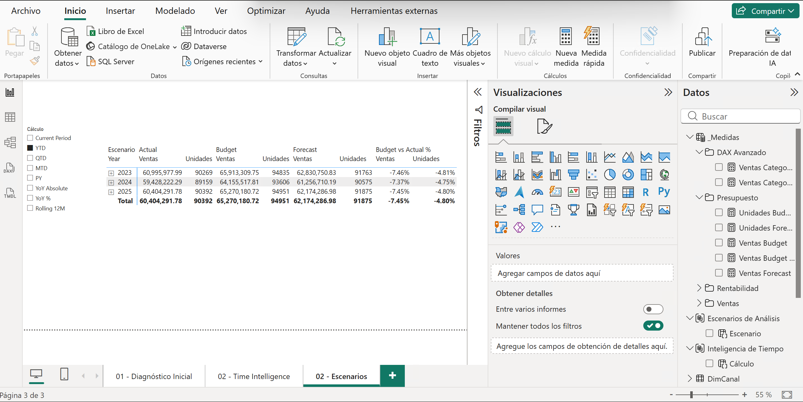
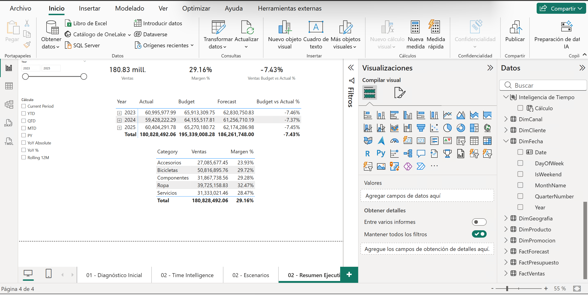

# Escalabilidad de Lógica de Negocio: Implementación de Grupos de Cálculo

## 1. Metadatos

| Atributo | Valor |
|---|---|
| **Duración** | 120 minutos |
| **Complejidad** | Alta |
| **Nivel Bloom** | Crear |
| **Módulo** | Módulo 2 — DAX Avanzado & Calculation Groups |
| **Herramientas** | Power BI Desktop, DAX, DAX Query View, DAX Studio (opcional) |
| **Archivo inicial** | `Lab01_VentasRetail_DeudaTecnica.pbix` (copia de la salida de Cap01) |
| **Archivo final esperado** | `Lab02_VentasRetail_DAX_CalculationGroups.pbix` |

---

## 2. Descripción General

En el Capítulo 01 dejaste un modelo de ventas retail optimizado en esquema estrella. En este laboratorio tomarás ese modelo y **profesionalizarás la lógica analítica para evitar la proliferación de medidas**: en lugar de crear medidas físicas como `Ventas YTD`, `Ventas MTD`, `Ventas PY`, `Ventas Budget` o `Ventas Forecast`, construirás dos **Calculation Groups** reutilizables que se aplican sobre cualquier medida base.

La ruta principal usa las capacidades nativas de **Power BI Desktop** para crear los grupos de cálculo desde la vista Modelo; Tabular Editor queda como alternativa. También incorporarás dos tablas de escenario (`FactPresupuesto` y `FactForecast`) desde CSV, configurarás *format strings* dinámicos y validarás todo con DAX Query View.

---

## 3. Objetivos de Aprendizaje

Al finalizar este laboratorio serás capaz de:

- Crear medidas explícitas que eviten depender de agregaciones implícitas.
- Usar `CALCULATE`, `KEEPFILTERS`, transiciones de contexto y variables `VAR` para construir lógica mantenible.
- Importar `FactPresupuesto` y `FactForecast` desde CSV y relacionarlas con `DimFecha`.
- Crear el grupo de cálculo `Inteligencia de Tiempo` con YTD, QTD, MTD, PY, YoY y Rolling 12M.
- Crear el grupo de cálculo `Escenarios de Análisis` con Actual, Budget, Forecast y Budget vs Actual %.
- Configurar precedencia (*precedence*) y *format strings* dinámicos.
- Validar la interacción entre ambos grupos con visuales y DAX Query View.

---

## 4. Insumos del laboratorio

**Antes de comenzar, verifica que tienes todo esto** (los detalles de instalación están en `../SETUP.md`):

| Insumo | Detalle |
|---|---|
| **Entrada** | `C:\LabPowerBI\Lab01\Lab01_VentasRetail_DeudaTecnica.pbix` (salida de Cap01) |
| **Datos nuevos** | `C:\LabPowerBI\AllFiles\FactPresupuesto.csv` y `FactForecast.csv` |
| **Herramientas** | Power BI Desktop actualizado, con vista **Modelo** y **DAX Query View** disponibles |
| **Salida** | `C:\LabPowerBI\Lab02\Lab02_VentasRetail_DAX_CalculationGroups.pbix` |

---

## 5. Escenario del laboratorio

El equipo de planeación necesita comparar **ventas reales contra presupuesto y forecast**, y analizar cualquier medida en distintas ventanas de tiempo (YTD, año anterior, variación interanual). Hoy eso implicaría decenas de medidas casi idénticas. Tu trabajo es resolverlo con dos grupos de cálculo que multipliquen la lógica sin multiplicar las medidas.

---

## 6. Instrucciones Paso a Paso

---

### Paso 0 — Preparar el archivo de inicio

**Objetivo:** crear una copia de trabajo a partir de la salida del Capítulo 01, sin alterar el original.

1. Copia `C:\LabPowerBI\Lab01\Lab01_VentasRetail_DeudaTecnica.pbix`.
2. Pégalo en `C:\LabPowerBI\Lab02\`.
3. Renómbralo como `Lab02_VentasRetail_DAX_CalculationGroups.pbix`.
4. Abre `Lab02_VentasRetail_DAX_CalculationGroups.pbix` y confirma que se abre sin errores, con las tablas, relaciones y medidas del Capítulo 01.

#### Resultado Esperado

- `Lab02_VentasRetail_DAX_CalculationGroups.pbix` existe en `C:\LabPowerBI\Lab02\`.
- El modelo abre sin errores y conserva las tablas y medidas del Capítulo 01.

---

### Paso 1 — Marcar `DimFecha` como tabla de fechas

**Objetivo:** garantizar que las funciones de inteligencia de tiempo (`DATESYTD`, `SAMEPERIODLASTYEAR`, etc.) funcionen correctamente.

1. En la vista **Tabla** o **Modelo**, selecciona `DimFecha`.
2. Ve a **Herramientas de tabla → Marcar como tabla de fechas**.
3. Selecciona la columna de fecha: `DimFecha[Date]`.
4. Acepta. Power BI validará que la columna no tiene huecos ni duplicados.

#### Resultado Esperado

- `DimFecha` aparece con el icono de tabla de fechas. Las funciones de inteligencia de tiempo funcionarán correctamente sobre esta tabla.

---

### Paso 2 — Importar presupuesto y forecast desde CSV

**Objetivo:** agregar los insumos de escenario que alimentarán el segundo grupo de cálculo.

1. Selecciona **Inicio → Transformar datos** para abrir Power Query.
2. **Nuevo origen → Texto/CSV** e importa `C:\LabPowerBI\AllFiles\FactPresupuesto.csv`.
3. Confirma los tipos de la consulta `FactPresupuesto`:

   | Columna | Tipo |
   |---|---|
   | `DateKey` | Número entero |
   | `ImporteVentaBudget` | Número decimal |
   | `CantidadBudget` | Número entero |

4. Repite con `C:\LabPowerBI\AllFiles\FactForecast.csv` y confirma los tipos de `FactForecast`:

   | Columna | Tipo |
   |---|---|
   | `DateKey` | Número entero |
   | `ImporteVentaForecast` | Número decimal |
   | `CantidadForecast` | Número entero |

5. Selecciona **Cerrar y aplicar**.
6. En la vista **Modelo**, crea estas relaciones (dirección de filtro única desde `DimFecha`):

   ```text
   DimFecha[DateKey]  1 → *  FactPresupuesto[DateKey]
   DimFecha[DateKey]  1 → *  FactForecast[DateKey]
   ```

   > Las tablas de escenario tienen grano **mensual**: su `DateKey` corresponde siempre al primer día del mes (p. ej. `20230101`). Al filtrar por `DimFecha`, el presupuesto y el forecast se acumulan correctamente por mes.

   > **Advertencia de grano:** `FactPresupuesto` y `FactForecast` no tienen producto, cliente ni región. Analiza Budget y Forecast principalmente por fecha. Si los cruzas contra `DimProducto`, `DimCliente` o `DimGeografia`, el valor puede repetirse o generar interpretaciones incorrectas.



#### Resultado Esperado

- `FactPresupuesto` y `FactForecast` existen y responden a filtros de `DimFecha`.

---

### Paso 3 — Crear medidas de escenario y demostrar `KEEPFILTERS`

**Objetivo:** crear las medidas base de presupuesto/forecast y dos medidas que evidencien `KEEPFILTERS` y `VAR`.

1. En la tabla `_Medidas`, crea una carpeta de visualización `Presupuesto` y agrega:

   ```dax
   Ventas Budget = SUM(FactPresupuesto[ImporteVentaBudget])
   ```
   ```dax
   Unidades Budget = SUM(FactPresupuesto[CantidadBudget])
   ```
   ```dax
   Ventas Forecast = SUM(FactForecast[ImporteVentaForecast])
   ```
   ```dax
   Unidades Forecast = SUM(FactForecast[CantidadForecast])
   ```

2. Crea una carpeta `DAX Avanzado` y agrega esta medida (las categorías existen en `DimProducto[Category]`):

   ```dax
   Ventas Categorias Prioritarias =
   CALCULATE(
       [Ventas],
       KEEPFILTERS(DimProducto[Category] IN {"Bicicletas", "Accesorios"})
   )
   ```

3. Agrega la versión porcentual basada en variables:

   ```dax
   Ventas Categorias Prioritarias % =
   VAR _Prioritarias = [Ventas Categorias Prioritarias]
   VAR _Totales = [Ventas]
   RETURN
       DIVIDE(_Prioritarias, _Totales, 0)
   ```

4. **Validación rápida:** crea una tabla visual con `DimFecha[Year]`, `DimFecha[MonthName]`, `[Ventas]`, `[Ventas Budget]`, `[Ventas Forecast]` y `[Ventas Categorias Prioritarias %]`. Debes ver valores para los meses con datos.



#### Resultado Esperado

- Existen `Ventas Budget`, `Unidades Budget`, `Ventas Forecast`, `Unidades Forecast` con valores no vacíos.
- `Ventas Categorias Prioritarias` devuelve un subtotal coherente menor o igual a `[Ventas]`.

---

### Paso 4 — Crear el grupo de cálculo `Inteligencia de Tiempo`

**Objetivo:** reemplazar medidas físicas de tiempo por un grupo de cálculo reutilizable.

1. Cambia a la vista **Modelo**.
2. Crea el grupo de cálculo por cualquiera de estas vías (ambas válidas):
   - En el panel **Datos**, en la pestaña **Modelo**, haz **clic → Grupos de Cálculo → Nuevo grupo de cálculo**, **o**
   - Usa el botón **Grupo de cálculo** en la pestaña de **Inicio** en la parte superior.

3. Si Power BI ofrece activar **Discourage implicit measures** (desaconsejar medidas implícitas), **acéptalo**. Los grupos de cálculo se aplican sobre medidas explícitas, y el modelo ya trabaja con medidas explícitas en `_Medidas`.
4. Renombra el grupo como `Inteligencia de Tiempo` y su columna como `Cálculo`.
5. En el panel de propiedades del grupo, establece **Precedencia = 50**.

>![NOTE]
> La precedencia determina el orden de aplicación de los grupos de cálculo. Un grupo con Precedencia 50 se aplica antes que otro con Precedencia 10. En este caso, queremos que el grupo de tiempo se aplique antes que el grupo de escenario, para que al seleccionar YTD + Budget, por ejemplo, primero se calcule el YTD y luego se reemplace por el valor de Budget. Entre mas alto el valor de precedencia, más arriba en la jerarquía de aplicación se encuentra el grupo.

6. Crea los siguientes *Elementos de cálculo* (item = nombre, expresión y *format string expression*), dando clic en **Elementos de cálculo → Nuevo elemento de cálculo** para cada uno:

   | Ordinal | Item | Expresión DAX | Format string expression |
   |---:|---|---|---|
   | 0 | Current Period | `SELECTEDMEASURE()` | `SELECTEDMEASUREFORMATSTRING()` |
   | 1 | YTD | `CALCULATE(SELECTEDMEASURE(), DATESYTD(DimFecha[Date]))` | `SELECTEDMEASUREFORMATSTRING()` |
   | 2 | QTD | `CALCULATE(SELECTEDMEASURE(), DATESQTD(DimFecha[Date]))` | `SELECTEDMEASUREFORMATSTRING()` |
   | 3 | MTD | `CALCULATE(SELECTEDMEASURE(), DATESMTD(DimFecha[Date]))` | `SELECTEDMEASUREFORMATSTRING()` |
   | 4 | PY | `CALCULATE(SELECTEDMEASURE(), SAMEPERIODLASTYEAR(DimFecha[Date]))` | `SELECTEDMEASUREFORMATSTRING()` |
   | 5 | YoY Absolute | `SELECTEDMEASURE() - CALCULATE(SELECTEDMEASURE(), SAMEPERIODLASTYEAR(DimFecha[Date]))` | `SELECTEDMEASUREFORMATSTRING()` |
   | 6 | YoY % | *(ver bloque abajo)* | `"0.00%;-0.00%;0.00%"` |
   | 7 | Rolling 12M | `CALCULATE(SELECTEDMEASURE(), DATESINPERIOD(DimFecha[Date], MAX(DimFecha[Date]), -12, MONTH))` | `SELECTEDMEASUREFORMATSTRING()` |

   Para el item **YoY %**, ingresa la expresión multilínea:

   ```dax
   VAR _Actual = SELECTEDMEASURE()
   VAR _PY =
       CALCULATE(
           SELECTEDMEASURE(),
           SAMEPERIODLASTYEAR(DimFecha[Date])
       )
   RETURN
       DIVIDE(_Actual - _PY, _PY, 0)
   ```



#### Resultado Esperado

- El panel de campos muestra el grupo `Inteligencia de Tiempo` con la columna `Cálculo` y 8 items.

---

### Paso 5 — Validar inteligencia de tiempo

**Objetivo:** comprobar que cada item de tiempo se comporta como se espera.

1. Crea una página llamada `02 - Time Intelligence` en la vista de **Informe**.
2. Agrega una matriz:

   | Contenedor | Campo |
   |---|---|
   | Filas | `DimFecha[Year]`, `DimFecha[MonthName]` |
   | Columnas | `Inteligencia de Tiempo[Cálculo]` |
   | Valores | `[Ventas]` |

3. Agrega un segmentador con `DimProducto[Category]`.
4. Filtra la página a un año con datos completos (2024 es buena opción: el calendario va de 2023 a 2025).
5. Confirma que:
   - `Current Period` muestra ventas del periodo.
   - `YTD` acumula dentro del año.
   - `PY` muestra el periodo del año anterior.
   - `YoY %` se formatea como porcentaje.
   - `Rolling 12M` acumula los últimos 12 meses respecto al contexto visible.

6. Opcionalmente, abre **DAX Query View** y ejecuta:

   ```dax
   EVALUATE
   SUMMARIZECOLUMNS(
       DimFecha[Year],
       'Inteligencia de Tiempo'[Cálculo],
       "Ventas", [Ventas]
   )
   ORDER BY DimFecha[Year], 'Inteligencia de Tiempo'[Cálculo]
   ```



#### Resultado Esperado

- Cada item devuelve resultados coherentes; `YTD` y `PY` difieren de `Current Period`.

---

### Paso 6 — Crear el grupo de cálculo `Escenarios de Análisis`

**Objetivo:** permitir alternar entre Actual, Budget, Forecast y la variación Budget vs Actual % sobre las medidas de ventas y unidades.

1. En la vista **Modelo**, crea otro grupo de cálculo.
2. Renómbralo como `Escenarios de Análisis` y su columna como `Escenario`.
3. Establece **Precedence = 10** (menor que el grupo de tiempo, para que el tiempo se aplique encima del escenario).
4. Crea estos *Calculation Items*:

   **Actual**
   ```dax
   SELECTEDMEASURE()
   ```
   Format string expression: `SELECTEDMEASUREFORMATSTRING()`

   **Budget**
   ```dax
   SWITCH(
       TRUE(),
       ISSELECTEDMEASURE([Ventas]),   [Ventas Budget],
       ISSELECTEDMEASURE([Unidades]), [Unidades Budget],
       BLANK()
   )
   ```
   Format string expression: `SELECTEDMEASUREFORMATSTRING()`

   **Forecast**
   ```dax
   SWITCH(
       TRUE(),
       ISSELECTEDMEASURE([Ventas]),   [Ventas Forecast],
       ISSELECTEDMEASURE([Unidades]), [Unidades Forecast],
       BLANK()
   )
   ```
   Format string expression: `SELECTEDMEASUREFORMATSTRING()`

   **Budget vs Actual %**
   ```dax
   VAR _Actual = SELECTEDMEASURE()
   VAR _Budget =
       SWITCH(
           TRUE(),
           ISSELECTEDMEASURE([Ventas]),   [Ventas Budget],
           ISSELECTEDMEASURE([Unidades]), [Unidades Budget],
           BLANK()
       )
   RETURN
       DIVIDE(_Actual - _Budget, _Budget, 0)
   ```
   Format string expression: `"0.00%;-0.00%;0.00%"`

> **Nota de diseño:** `Budget` y `Forecast` solo aplican a `[Ventas]` y `[Unidades]`, porque el dataset de práctica no tiene presupuesto de costo, margen ni ticket promedio. Para esas medidas, el resultado en Budget/Forecast queda en **blanco por diseño**.

5. Crea una medida puente explícita para usar en tarjetas, Smart Narrative y validaciones donde se requiera una medida física:

   ```dax
   Ventas Budget vs Actual % =
   CALCULATE(
       [Ventas],
       'Escenarios de Análisis'[Escenario] = "Budget vs Actual %"
   )
   ```

   Formato: porcentaje con dos decimales.

   > **Nota:** `Budget vs Actual %` es un **Calculation Item**, no una medida física. La medida física canónica para capítulos posteriores es `[Ventas Budget vs Actual %]`.



#### Resultado Esperado

- El grupo `Escenarios de Análisis` tiene 4 items y `Precedence = 10`.
- Existe la medida física `[Ventas Budget vs Actual %]` para validaciones y narrativas.

---

### Paso 7 — Validar la composición tiempo por escenario

**Objetivo:** confirmar que ambos grupos se combinan correctamente.

1. Crea una página `02 - Escenarios`.
2. Agrega una matriz:

   | Contenedor | Campo |
   |---|---|
   | Filas | `DimFecha[Year]`, `DimFecha[MonthName]` |
   | Columnas | `Escenarios de Análisis[Escenario]` |
   | Valores | `[Ventas]`, `[Unidades]` |

3. Agrega un segmentador con `Inteligencia de Tiempo[Cálculo]`.
4. Selecciona `YTD` y valida que `Budget` también se acumule en el año.
5. Selecciona `Budget vs Actual %` y confirma el formato porcentual.

   Consulta opcional en DAX Query View o DAX Studio:

   ```dax
   EVALUATE
   SUMMARIZECOLUMNS(
       DimFecha[Year],
       'Inteligencia de Tiempo'[Cálculo],
       'Escenarios de Análisis'[Escenario],
       "Ventas", [Ventas]
   )
   ORDER BY
       DimFecha[Year],
       'Inteligencia de Tiempo'[Cálculo],
       'Escenarios de Análisis'[Escenario]
   ```



#### Resultado Esperado

- Las combinaciones `YTD + Budget`, `YTD + Forecast` y `YTD + Budget vs Actual %` devuelven resultados coherentes.

---

### Paso 8 — Integrar al informe y guardar la salida

**Objetivo:** dejar una página de resumen ejecutivo y guardar el archivo final del capítulo.

1. Crea una página `02 - Resumen Ejecutivo` con:
   - Tarjeta: `[Ventas]`.
   - Tarjeta: `[Margen %]`.
   - Tarjeta: `[Ventas Budget vs Actual %]`.
   - Matriz de escenarios: `DimFecha[Year]` y `DimFecha[MonthName]` en filas, `Escenarios de Análisis[Escenario]` en columnas, valor `[Ventas]`.
   - Tabla de ventas reales por categoría: `DimProducto[Category]`, `[Ventas]`, `[Margen %]`.
   - Segmentador: `Inteligencia de Tiempo[Cálculo]`.
   - Segmentador: `DimFecha[Year]`.
2. Evita mezclar Budget/Forecast con `DimProducto[Category]`, cliente o región, salvo que expliques que esas tablas de escenario solo tienen grano mensual.
3. Verifica que los segmentadores afecten correctamente todas las visualizaciones.
4. Guarda como `C:\LabPowerBI\Lab02\Lab02_VentasRetail_DAX_CalculationGroups.pbix`.



#### Resultado Esperado

- `Lab02_VentasRetail_DAX_CalculationGroups.pbix` guardado, listo para ser la entrada del Capítulo 03.

---

## 8. Lista de verificación de completitud

| # | Verificación | Estado |
|---|---|--------|
| 1 | `DimFecha` marcada como tabla de fechas con `DimFecha[Date]` | ☐ |
| 2 | `FactPresupuesto` y `FactForecast` importadas y relacionadas con `DimFecha[DateKey]` | ☐ |
| 3 | Medidas `Ventas Budget`, `Unidades Budget`, `Ventas Forecast`, `Unidades Forecast` creadas | ☐ |
| 4 | Medida con `KEEPFILTERS` y su versión `%` con `VAR` creadas | ☐ |
| 5 | Grupo `Inteligencia de Tiempo`: 8 items, `Precedence = 50` | ☐ |
| 6 | Grupo `Escenarios de Análisis`: 4 items, `Precedence = 10` | ☐ |
| 7 | `YoY %` y `Budget vs Actual %` con formato porcentual | ☐ |
| 8 | Medida física `[Ventas Budget vs Actual %]` creada y formateada como porcentaje | ☐ |
| 9 | `Budget`/`Forecast` sobre `Costo` o `Margen` quedan en blanco (por diseño) | ☐ |
| 10 | Consulta de validación en DAX Query View ejecuta sin error | ☐ |
| 11 | `Lab02_VentasRetail_DAX_CalculationGroups.pbix` guardado | ☐ |

---

## 9. Cierre del laboratorio

**Encadenamiento con el siguiente laboratorio:**

- **Entrada de este lab:** `Lab01_VentasRetail_DeudaTecnica.pbix` (salida de Cap01).
- **Salida de este lab:** `Lab02_VentasRetail_DAX_CalculationGroups.pbix` ← **entrada del Capítulo 03**.


### Lo que aprendiste en este laboratorio

1. **Medidas explícitas y DAX avanzado:** consolidaste lógica con `CALCULATE`, `KEEPFILTERS`, `VAR` y transiciones de contexto.
2. **Escenarios desde CSV:** integraste presupuesto y forecast con relaciones de granularidad mensual hacia `DimFecha`.
3. **Calculation Groups nativos:** sustituiste decenas de medidas físicas por dos grupos reutilizables, con *format strings* dinámicos y precedencia controlada.
4. **Composición de grupos:** comprobaste cómo el tiempo y el escenario se combinan sin multiplicar el mantenimiento.

---

## 10. Recursos de referencia

| Recurso | URL |
|---|---|
| Crear grupos de cálculo en Power BI | https://learn.microsoft.com/power-bi/transform-model/calculation-groups |
| DAX Query View | https://learn.microsoft.com/power-bi/transform-model/dax-query-view |
| `SELECTEDMEASURE` | https://learn.microsoft.com/dax/selectedmeasure-function-dax |
| `ISSELECTEDMEASURE` | https://learn.microsoft.com/dax/isselectedmeasure-function-dax |
| Marcar como tabla de fechas | https://learn.microsoft.com/power-bi/transform-model/desktop-date-tables |
| Inteligencia de tiempo en DAX (SQLBI) | https://www.sqlbi.com/articles/time-intelligence-in-power-bi-desktop/ |
