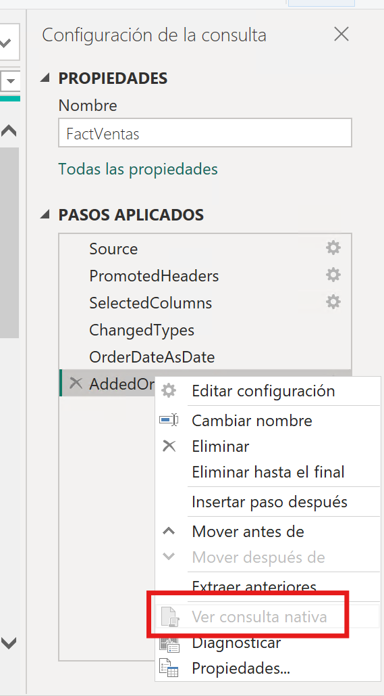
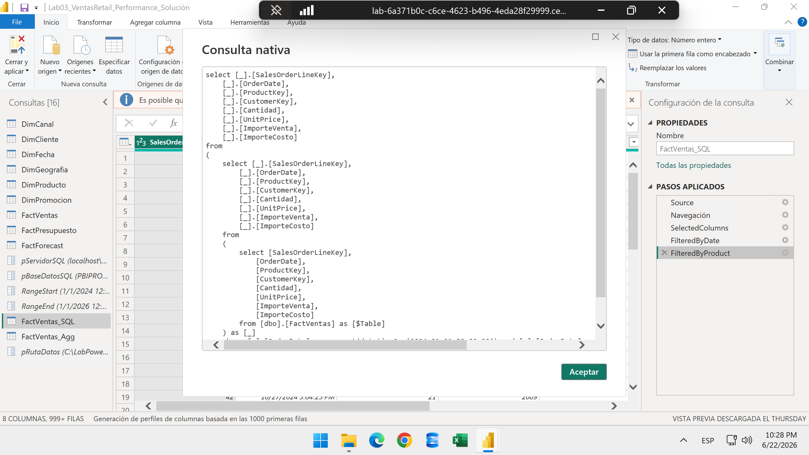
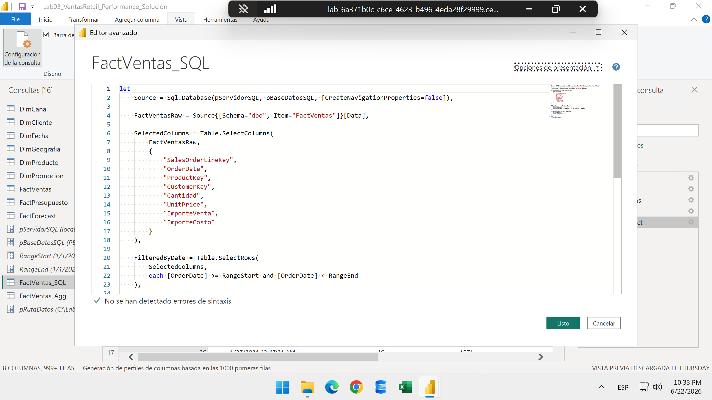
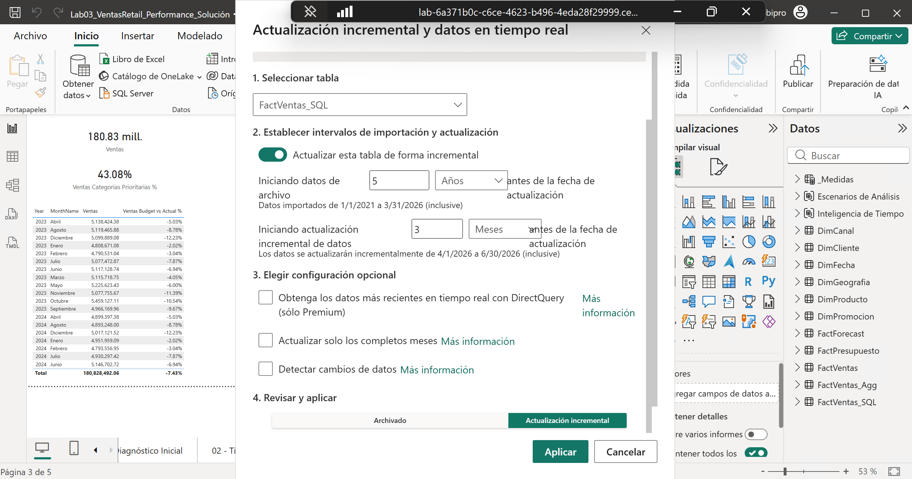
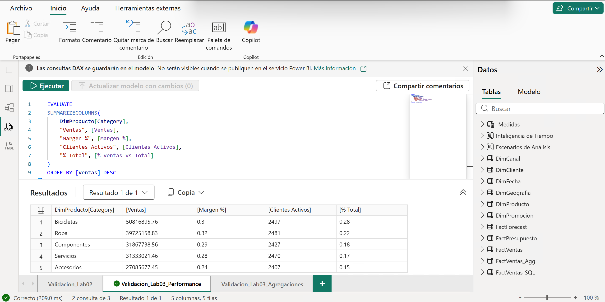
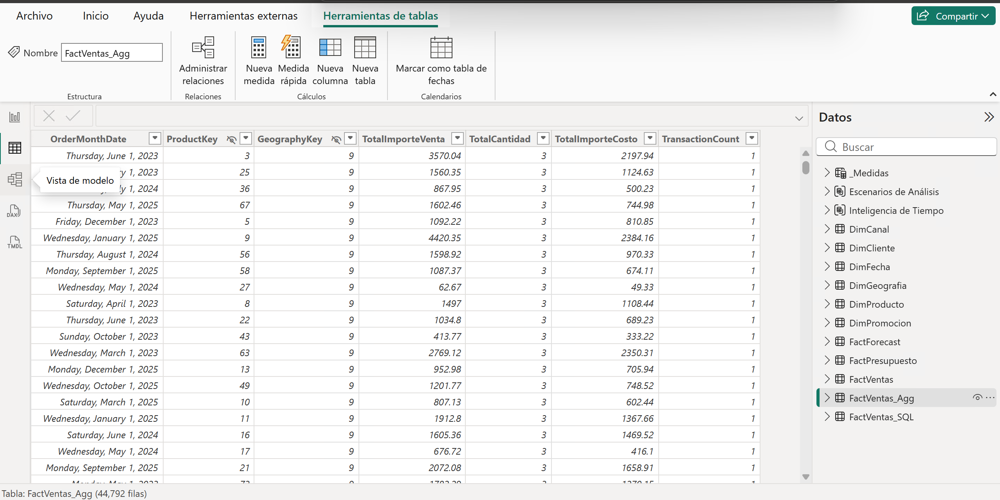
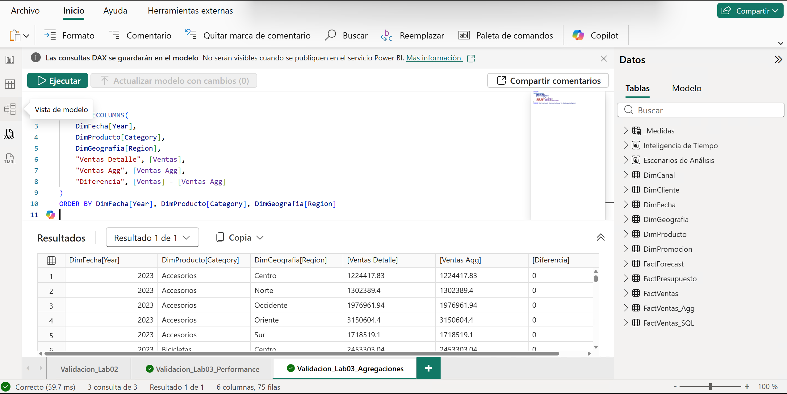

# Ingeniería de Performance: Query Folding, Incremental Refresh y Respuesta de Consultas

## 1. Metadatos

| Atributo | Valor |
|---|---|
| **Duración** | 120 minutos |
| **Complejidad** | Alta |
| **Nivel Bloom** | Analizar / Crear |
| **Módulo** | Módulo 3 — Performance, Escalabilidad & Query Folding |
| **Herramientas** | Power BI Desktop, Power Query, Performance Analyzer, DAX Studio, SQL Server o Azure SQL para demo acotada |
| **Archivo inicial** | `Lab03_Start.pbix` (copia de la salida de Cap02) |
| **Archivo final esperado** | `Lab03_VentasRetail_Performance.pbix` |
| **Ruta principal del modelo** | CSV existentes en `AllFiles` |
| **Demostración acotada** | SQL Server solo para Query Folding e Incremental Refresh |
| **Contingencia** | Ruta B con CSV si el alumno no puede usar SQL Server |

---

## 2. Descripción general

Hasta este punto el modelo se ha trabajado con archivos CSV para facilitar la continuidad del taller. Esa ruta se mantiene: las medidas, relaciones y páginas que pasarán a los capítulos 04 y 05 siguen usando `FactVentas` y las dimensiones cargadas desde `AllFiles`.

Sin embargo, los archivos CSV no permiten demostrar **Query Folding real** porque no tienen un motor de consulta que reciba transformaciones delegadas desde Power Query. Por eso, en este laboratorio se usará una copia relacional controlada de `FactVentas` en SQL Server para demostrar Query Folding e Incremental Refresh de forma técnicamente correcta.

La tabla SQL se llama `dbo.FactVentas` y se usa como referencia para mostrar qué transformaciones se pueden delegar al motor relacional. No es necesario convertir todo el modelo a SQL Server ni reemplazar la ruta CSV del curso.

---

## 3. Objetivos de aprendizaje

Al finalizar este laboratorio serás capaz de:

- Diagnosticar un escenario **No Folding** con archivos CSV.
- Preparar una tabla relacional pequeña y controlada para demostrar delegación de consultas.
- Conectar Power BI a SQL Server y validar **Ver consulta nativa**.
- Identificar folding completo, folding parcial y ruptura de folding.
- Configurar `RangeStart`, `RangeEnd` e Incremental Refresh sobre una tabla con filtro foldable.
- Medir visuales con Performance Analyzer y consultas con DAX Studio o DAX Query View.
- Crear una agregación `FactVentas_Agg` segura para RLS regional con grano `Mes × Producto × GeographyKey`.

---

## 4. Insumos del laboratorio

| Insumo | Detalle |
|---|---|
| **Entrada** | `Lab02_VentasRetail_DAX_CalculationGroups.pbix` |
| **Datos principales** | CSV de `C:\LabPowerBI\AllFiles\` |
| **CSV obligatorio para SQL** | `C:\LabPowerBI\AllFiles\FactVentas.csv` |
| **Base SQL sugerida** | `PBIPRO_Lab` |
| **Servidor sugerido** | `localhost\SQLEXPRESS` o `localhost` |
| **Salida** | `Lab03_VentasRetail_Performance.pbix` |

---

## 5. Contrato de continuidad del modelo

El archivo de entrada debe incluir:

| Objeto | Validación |
|---|---|
| Tablas base | `FactVentas`, `DimFecha`, `DimProducto`, `DimCliente`, `DimGeografia`, `DimCanal`, `DimPromocion`, `_Medidas`. |
| Tablas de escenario | `FactPresupuesto`, `FactForecast`. |
| Calculation Groups | `Inteligencia de Tiempo`, `Escenarios de Análisis`. |
| Medidas base | `[Ventas]`, `[Costo]`, `[Unidades]`, `[Margen]`, `[Margen %]`, `[Ticket Promedio]`. |
| Medidas escenario | `[Ventas Budget]`, `[Unidades Budget]`, `[Ventas Forecast]`, `[Unidades Forecast]`, `[Ventas Budget vs Actual %]`. |
| Relaciones críticas | `DimFecha[Date] → FactVentas[OrderDate]`, `DimProducto[ProductKey] → FactVentas[ProductKey]`, `DimCliente[CustomerKey] → FactVentas[CustomerKey]`, `DimGeografia[GeographyKey] → DimCliente[GeographyKey]`. |


---

## 6. Escenario del laboratorio

El equipo necesita mejorar tiempos de carga y respuesta. También necesita evidencia técnica de Query Folding e Incremental Refresh para defender el diseño ante un equipo de plataforma.

---

## 7. Instrucciones paso a paso

### Paso 0 — Preparar el archivo de inicio

**Objetivo:** crear la copia de trabajo del capítulo.

1. Copia `Lab02_VentasRetail_DAX_CalculationGroups.pbix` a `C:\LabPowerBI\Lab03\`.
2. Renómbralo como `Lab03_VentasRetail_Performance.pbix`.
3. Crea una página llamada `03 - Performance y Folding`.

#### Resultado esperado

- `Lab03_VentasRetail_Performance.pbix` existe.
- El modelo abre sin errores y conserva los objetos del Capítulo 02.

---

### Paso 1 — Diagnóstico con CSV

**Objetivo**: Demostrar que los archivos CSV no permiten Query Folding real y, aun así, aplicar buenas prácticas de carga local.

#### 1.1 Medir línea base

1. Abre **Inicio → Transformar datos**.
2. En Power Query, selecciona **Herramientas → Iniciar diagnóstico**.
3. Actualiza la vista previa de `FactVentas`.
4. Selecciona **Herramientas → Detener diagnóstico**.
5. Registra duración total, consulta más lenta y paso más costoso.
6. Cierra Power Query sin aplicar cambios.
7. En Power BI Desktop, abre **Optimize → Performance Analyzer**.
8. Selecciona **Start recording** y luego **Refresh visuals**.
9. Registra al menos tres visuales en la bitácora.

| Métrica | Valor inicial | Valor final |
|---|---:|---:|
| Vista previa `FactVentas` | ___ | ___ |
| Visual más lento | ___ | ___ |
| Consulta `[Ventas]` | ___ | ___ |
| Consulta `[Margen %]` | ___ | ___ |

#### 1.2 Refactorizar `FactVentas` desde CSV

1. Abre **Transformar datos** y selecciona `FactVentas`.
2. En el **Editor avanzado**, usa este patrón. Ajusta la ruta si ya usas un parámetro.

```powerquery
let
    Source = Csv.Document(
        File.Contents(pRutaDatos & "\FactVentas.csv"),
        [Delimiter=",", Columns=18, Encoding=65001, QuoteStyle=QuoteStyle.Csv]
    ),
    PromotedHeaders = Table.PromoteHeaders(Source, [PromoteAllScalars=true]),
    SelectedColumns = Table.SelectColumns(
        PromotedHeaders,
        {
            "SalesOrderLineKey", "OrderDate", "ProductKey", "CustomerKey",
            "CanalKey", "PromocionKey", "Cantidad", "UnitPrice",
            "ImporteVenta", "ImporteCosto"
        }
    ),
    ChangedTypes = Table.TransformColumnTypes(
        SelectedColumns,
        {
            {"SalesOrderLineKey", Int64.Type}, {"OrderDate", type datetime},
            {"ProductKey", Int64.Type}, {"CustomerKey", Int64.Type},
            {"CanalKey", Int64.Type}, {"PromocionKey", Int64.Type},
            {"Cantidad", Int64.Type}, {"UnitPrice", type number},
            {"ImporteVenta", type number}, {"ImporteCosto", type number}
        }
    ),
    OrderDateAsDate = Table.TransformColumns(
        ChangedTypes,
        {{"OrderDate", each Date.From(_), type date}}
    ),
    AddedOrderMonthDate = Table.AddColumn(
        OrderDateAsDate,
        "OrderMonthDate",
        each Date.StartOfMonth([OrderDate]),
        type date
    )
in
    AddedOrderMonthDate
```

3. Confirma que ya no se cargan columnas de alta cardinalidad como `ShipAddressFull`, `InternalNotes`, `ETLLoadID`, `OrderTimeStamp` y `ShipDate`.
4. Aplica un filtro simple por fecha en un paso temporal, por ejemplo `OrderDate >= #date(2024, 1, 1)`.
5. Selecciona columnas o cambia tipos como pasos adicionales.
6. Haz clic derecho sobre cada paso aplicado e intenta usar **Ver consulta nativa**.
7. Quita el filtro temporal si no lo necesitas para el modelo final.
8. Valida que para la consulta `FactVentas`, ver consulta nativa no aparece disponible porque un archivo
.CSV no tiene un motor relacional que reciba transformaciones delegadas.

>[!NOTE]
> Este escenario es válido para modelado, compresión y aprendizaje, pero no para demostrar Query Folding real.



#### Resultado esperado

- El alumno comprende el escenario **No Folding**.
- El alumno entiende que los CSV no permiten delegar transformaciones a un motor relacional.

---

### Paso 2 — Conexión desde Power BI a SQL Server

**Objetivo**: Conectar Power BI a la tabla relacional sin reemplazar la ruta CSV del curso.

1. Si estás en Power BI Desktop, abre **Inicio → Transformar datos**.
2. En Power Query, crea dos parámetros de texto:

| Parámetro | Valor sugerido |
|---|---|
| `pServidorSQL` | `localhost\SQLEXPRESS` o `localhost`  |
| `pBaseDatosSQL` | `PBIPRO_Lab` |

>[!NOTE]
> Confirma con el instructor el nombre del servidor o puedes ingresar a SQLSERVER y confirmar el nombre de la instancia.

3. Selecciona **Nuevo origen → SQL Server**.
4. Usa:

| Campo | Valor |
|---|---|
| Servidor | `localhost\SQLEXPRESS` o `localhost` |
| Base de datos | `PBIPRO_Lab` |
| Modo | Import |

5. Selecciona `dbo.FactVentas` y entra a **Transformar datos**.
6. Renombra la consulta como `FactVentas_SQL`.
7. Abre el **Editor avanzado** y deja el siguiente patrón y luego dar clic en **Listo**:

```powerquery
let
    Source = Sql.Database(pServidorSQL, pBaseDatosSQL, [CreateNavigationProperties=false]),
    FactVentasRaw = Source{[Schema="dbo", Item="FactVentas"]}[Data],
    SelectedColumns = Table.SelectColumns(
        FactVentasRaw,
        {
            "SalesOrderLineKey", "OrderDate", "ProductKey", "CustomerKey",
            "CanalKey", "PromocionKey", "Cantidad", "UnitPrice",
            "ImporteVenta", "ImporteCosto"
        }
    ),
    FilteredRows = Table.SelectRows(
        SelectedColumns,
        each [OrderDate] >= #datetime(2024, 1, 1, 0, 0, 0)
    )
in
    FilteredRows
```

8. Haz clic derecho sobre `FilteredRows` → **Ver consulta nativa**.
9. Confirma que Power Query muestra una consulta SQL delegada.



#### Resultado esperado

- El alumno observa que Power Query sí puede delegar transformaciones a SQL Server.
- La ruta principal del modelo sigue basada en CSV.

---

### Paso 3 — Demostración de Query Folding

**Objetivo**: Enseñar folding activo, ruptura de folding y recuperación de buenas prácticas.

#### A. Folding activo

1. En `FactVentas_SQL`, aplica las siguientes transformaciones adicionales desde el **Editor avanzado**:

```powerquery
let
    Source = Sql.Database(pServidorSQL, pBaseDatosSQL, [CreateNavigationProperties=false]),

    FactVentasRaw = Source{[Schema="dbo", Item="FactVentas"]}[Data],

    SelectedColumns = Table.SelectColumns(
        FactVentasRaw,
        {
            "SalesOrderLineKey",
            "OrderDate",
            "ProductKey",
            "CustomerKey",
            "Cantidad",
            "UnitPrice",
            "ImporteVenta",
            "ImporteCosto"
        }
    ),

    FilteredByDate = Table.SelectRows(
        SelectedColumns,
        each [OrderDate] >= #datetime(2024, 1, 1, 0, 0, 0)
    ),

    FilteredByProduct = Table.SelectRows(
        FilteredByDate,
        each [ProductKey] <= 50
    )
in
    FilteredByProduct
```

2. Haz clic derecho sobre `FilteredByProduct` → **Ver consulta nativa**.
3. Revisa que la consulta SQL incluya selección de columnas y filtros.

#### Resultado esperado

- El filtro y la selección de columnas se delegan al motor SQL Server.

#### B. Ruptura de folding

1. Después del filtro, agrega un paso no foldable, por ejemplo:

```powerquery
AddedCustomIndex = Table.AddIndexColumn(
    FilteredByProduct,
    "IndiceLocal",
    1,
    1,
    Int64.Type
)
```

2. Intenta usar **Ver consulta nativa** sobre `AddedCustomIndex`.
3. Si la opción queda deshabilitada o el indicador de plegado cambia, registra la ruptura.

También puedes romper folding con una función personalizada compleja o una conversión textual innecesaria antes del filtro.

>[!NOTE]
> La ruptura de folding no es un error, pero sí un diagnóstico para entender qué transformaciones se pueden delegar y cuáles no. Entre las que no: índices personalizados, funciones personalizadas complejas, transformaciones de tipo no compatibles, pasos que requieren toda la tabla para procesar (ej. `Table.AddColumn` sin posibilidad de plegar) y transformaciones específicas de Power Query que no tienen equivalente SQL.

#### Explicación

Cuando el folding se rompe demasiado temprano, Power Query debe traer más datos y procesarlos localmente. En modelos grandes, eso impacta refresh, memoria y tiempo de espera.

#### C. Recuperación de buenas prácticas

1. Reordena pasos para dejar primero lo que sí puede plegarse:
   - Filtros por fecha y llaves.
   - Selección de columnas.
   - Cambios de tipo compatibles.
2. Mueve transformaciones no foldables al final.
3. Valida nuevamente **Ver consulta nativa** en el último paso foldable.

#### Resultado esperado

- El alumno entiende cómo preservar Query Folding el mayor tiempo posible.

---

### Paso 4 — Configuración de Incremental Refresh

**Objetivo**: Configurar Incremental Refresh correctamente usando un origen relacional con filtro foldable.

1. En Power Query, crea dos parámetros:

| Parámetro | Tipo | Valor actual sugerido |
|---|---|---|
| `RangeStart` | Date/Time | `01/01/2024 00:00:00` |
| `RangeEnd` | Date/Time | `01/01/2026 00:00:00` |

2. En `FactVentas_SQL`, reemplaza en **Editor Avanzado** el filtro por fecha con este patrón:

```powerquery
let
    Source = Sql.Database(pServidorSQL, pBaseDatosSQL, [CreateNavigationProperties=false]),

    FactVentasRaw = Source{[Schema="dbo", Item="FactVentas"]}[Data],

    SelectedColumns = Table.SelectColumns(
        FactVentasRaw,
        {
            "SalesOrderLineKey",
            "OrderDate",
            "ProductKey",
            "CustomerKey",
            "Cantidad",
            "UnitPrice",
            "ImporteVenta",
            "ImporteCosto"
        }
    ),

    FilteredByDate = Table.SelectRows(
        SelectedColumns,
        each [OrderDate] >= RangeStart and [OrderDate] < RangeEnd
    ),

    FilteredByProduct = Table.SelectRows(
        FilteredByDate,
        each [ProductKey] <= 50
    )
in
    FilteredByProduct
```

3. Haz clic derecho sobre `FilteredByDate` → **Ver consulta nativa**.



4. Confirma que el filtro por `OrderDate` se puede plegar.
5. Selecciona **Cerrar y aplicar**.
6. En el campo **Datos**, haz clic derecho sobre `FactVentas_SQL` → **Actualización incremental**.
7. Configura una política de ejemplo:

| Opción | Valor sugerido |
|---|---|
| Iniciando datos de archivo| 5 años |
| Iniciando actualización incremental de datos | 3 meses |
| Detectar cambios de datos | Desactivado para el laboratorio |
| Obtener datos en tiempo real con DirectQuery | Desactivado |

> [!IMPORTANT] 
> `FactVentas_SQL` existe para demostrar Incremental Refresh foldable. Las medidas y páginas principales del curso siguen usando `FactVentas` desde CSV.



>[!NOTE]
> Incrementar Refresh para probar el resultado se debe publicar el archivo al servicio de Power BI y conectar la información local a través de un Gateway. Para este laboratorio, la demostración de Incremental Refresh se centra en la configuración y validación de folding en Power Query.

#### Resultado esperado

- El alumno configura una política de Incremental Refresh sobre una tabla con filtro por fecha y posibilidad de folding.

---

### Paso 5 — Performance Analyzer, DAX y agregación segura para RLS

**Objetivo**: Medir la respuesta del modelo principal y crear una agregación que respete filtros regionales en Capítulo 04.

#### 5.1 Optimizar medidas DAX

1. En `_Medidas`, reemplaza `Margen %` por esta versión con `VAR`:

```dax
Margen % =
VAR _Ventas = [Ventas]
VAR _Costo = [Costo]
VAR _Margen = _Ventas - _Costo
RETURN
    DIVIDE(_Margen, _Ventas, 0)
```

2. Crea una carpeta `Performance` y agrega:

```dax
Clientes Activos =
CALCULATE(
    DISTINCTCOUNT(FactVentas[CustomerKey]),
    FactVentas[ImporteVenta] > 0
)
```

```dax
Ventas Top Regiones =
SUMX(
    TOPN(5, ALL(DimGeografia[Region]), [Ventas], DESC),
    [Ventas]
)
```

```dax
% Ventas vs Total =
DIVIDE(
    [Ventas],
    CALCULATE(
        [Ventas],
        REMOVEFILTERS(DimProducto),
        REMOVEFILTERS(DimGeografia),
        REMOVEFILTERS(DimCliente)
    ),
    0
)
```

3. En DAX Query View o DAX Studio, ejecuta:

```dax
EVALUATE
SUMMARIZECOLUMNS(
    DimProducto[Category],
    "Ventas", [Ventas],
    "Margen %", [Margen %],
    "Clientes Activos", [Clientes Activos],
    "% Total", [% Ventas vs Total]
)
ORDER BY [Ventas] DESC
```

4. Registra tiempos con Performance Analyzer o Server Timings.



#### Resultado esperado

- Las medidas de performance existen y la consulta corre sin error.

#### 5.2 Crear `FactVentas_Agg` con granularidad Mes × Producto × GeographyKey

**Advertencia técnica:** si `FactVentas_Agg` se agrupa solo por mes y producto, no respetará correctamente RLS regional en el Capítulo 04. La agregación debe incluir `GeographyKey`.

1. En Power Query, haz clic derecho sobre `FactVentas.csv` → **Referencia**.
2. Renombra la consulta como `FactVentas_Agg`.

>[!NOTE]
> Referencia en lugar de duplicar para preservar la conexión al CSV original y evitar confusiones. La consulta `FactVentas_Agg` se carga al modelo solo para la agregación, no para reemplazar `FactVentas` en el modelo principal.

3. Abre el Editor avanzado y debes visualizar el siguiente patrón, sino cámbialo:

```powerquery
let
    Source = FactVentas,
    SourceWithMonth =
        if Table.HasColumns(Source, "OrderMonthDate") then
            Source
        else
            Table.AddColumn(
                Source,
                "OrderMonthDate",
                each Date.StartOfMonth([OrderDate]),
                type date
            ),
    MergeCliente = Table.NestedJoin(
        SourceWithMonth,
        {"CustomerKey"},
        DimCliente,
        {"CustomerKey"},
        "DimCliente",
        JoinKind.LeftOuter
    ),
    ExpandGeo = Table.ExpandTableColumn(
        MergeCliente,
        "DimCliente",
        {"GeographyKey"},
        {"GeographyKey"}
    ),
    GroupedRows = Table.Group(
        ExpandGeo,
        {"OrderMonthDate", "ProductKey", "GeographyKey"},
        {
            {"TotalImporteVenta", each List.Sum([ImporteVenta]), type number},
            {"TotalCantidad", each List.Sum([Cantidad]), Int64.Type},
            {"TotalImporteCosto", each List.Sum([ImporteCosto]), type number},
            {"TransactionCount", each Table.RowCount(_), Int64.Type}
        }
    )
in
    GroupedRows
```

4. Selecciona **Cerrar y aplicar**.
5. En la vista **Modelo**, crea estas relaciones con dirección de filtro única:

```text
DimFecha[Date]              1 → *  FactVentas_Agg[OrderMonthDate]
DimProducto[ProductKey]     1 → *  FactVentas_Agg[ProductKey]
DimGeografia[GeographyKey]  1 → *  FactVentas_Agg[GeographyKey]
```

6. Crea estas medidas en una carpeta `Agregaciones`:

```dax
Ventas Agg   = SUM(FactVentas_Agg[TotalImporteVenta])
Costo Agg    = SUM(FactVentas_Agg[TotalImporteCosto])
Unidades Agg = SUM(FactVentas_Agg[TotalCantidad])
```

```dax
Margen % Agg =
VAR _Ventas = [Ventas Agg]
VAR _Costo = [Costo Agg]
RETURN
    DIVIDE(_Ventas - _Costo, _Ventas, 0)
```


#### Resultado esperado

- `FactVentas_Agg` existe con granularidad `Mes × Producto × GeographyKey`.
- La futura RLS regional de Capítulo 04 podrá filtrar la agregación.

#### 5.3 Comparar detalle vs agregación

1. Crea una página `03 - Agregaciones`.
2. Agrega dos matrices:

| Matriz | Filas | Valores |
|---|---|---|
| Detalle | `DimFecha[Year]`, `DimProducto[Category]`, `DimGeografia[Region]` | `[Ventas]`, `[Margen %]` |
| Agregada | `DimFecha[Year]`, `DimProducto[Category]`, `DimGeografia[Region]` | `[Ventas Agg]`, `[Margen % Agg]` |

3. Abre **Performance Analyzer**, mide ambas matrices y registra tiempos.
4. Ejecuta esta validación:

```dax
EVALUATE
SUMMARIZECOLUMNS(
    DimFecha[Year],
    DimProducto[Category],
    DimGeografia[Region],
    "Ventas Detalle", [Ventas],
    "Ventas Agg", [Ventas Agg],
    "Diferencia", [Ventas] - [Ventas Agg]
)
ORDER BY DimFecha[Year], DimProducto[Category], DimGeografia[Region]
```


#### Resultado esperado

- La diferencia es cero o insignificante por redondeo.
- La agregación es válida en análisis por fecha, producto y región.
- No uses medidas `Agg` en visuales que requieran cliente, canal, promoción o detalle transaccional.

---

### Paso 7 — Guardar la salida

1. Elimina consultas de diagnóstico que hayan quedado cargadas.
2. Conserva las páginas de medición.
3. Oculta la tabla `FactVentas_SQL`.
4. No publiques todavía; la publicación se realiza en el Capítulo 04.

#### Resultado esperado

- `Lab03_VentasRetail_Performance.pbix` queda listo para el Capítulo 04.

---

## 8. Lista de verificación de completitud

| # | Verificación | Estado |
|---|---|---|
| 1 | `FactVentas` CSV reducida y con `OrderMonthDate` | ☐ |
| 2 | Conclusión de no-folding con CSV documentada | ☐ |
| 3 | Scripts SQL ejecutados o Ruta B documentada | ☐ |
| 4 | `FactVentas_SQL` conectada a `PBIPRO_Lab.dbo.FactVentas` | ☐ |
| 5 | `Ver consulta nativa` validado sobre pasos foldables en SQL Server | ☐ |
| 6 | Ruptura y recuperación de folding demostradas | ☐ |
| 7 | `RangeStart` y `RangeEnd` creados como Date/Time | ☐ |
| 8 | Incremental Refresh configurado sobre `FactVentas_SQL` o contingencia CSV documentada | ☐ |
| 9 | Medidas de performance creadas | ☐ |
| 10 | `FactVentas_Agg` con grano `Mes × Producto × GeographyKey` y relaciones a fecha, producto y geografía | ☐ |
| 11 | Comparación detalle vs agregación validada | ☐ |
| 12 | `Lab03_VentasRetail_Performance.pbix` guardado | ☐ |

---

## 9. Cierre del laboratorio

**Encadenamiento:**

- **Entrada de este lab:** `Lab02_VentasRetail_DAX_CalculationGroups.pbix`.
- **Salida de este lab:** `Lab03_VentasRetail_Performance.pbix` ← entrada del Capítulo 04.

### Lo que aprendiste

1. **CSV como ruta principal:** optimizaste carga local sin prometer folding inexistente.
2. **SQL Server como demostración acotada:** usaste una copia relacional de `FactVentas` para validar consulta nativa.
3. **Incremental Refresh defendible:** aplicaste la política sobre una tabla con filtro por fecha foldable.
4. **Performance de visuales:** mediste y optimizaste con Performance Analyzer, DAX Studio y medidas explícitas.
5. **Agregación compatible con seguridad:** agregaste `GeographyKey` para evitar fugas o totales incorrectos con RLS regional.

---

## 10. Recursos de referencia

| Recurso | URL |
|---|---|
| Conceptos de Query Folding | https://learn.microsoft.com/power-query/query-folding-basics |
| Query Folding en Power BI Desktop | https://learn.microsoft.com/power-bi/guidance/power-query-folding |
| Indicadores de plegado de pasos | https://learn.microsoft.com/power-query/step-folding-indicators |
| Incremental Refresh | https://learn.microsoft.com/power-bi/connect-data/incremental-refresh-overview |
| Configurar Incremental Refresh | https://learn.microsoft.com/power-bi/connect-data/incremental-refresh-configure |
| Performance Analyzer | https://learn.microsoft.com/power-bi/create-reports/performance-analyzer |
| Buenas prácticas de Power Query | https://learn.microsoft.com/power-query/best-practices |
