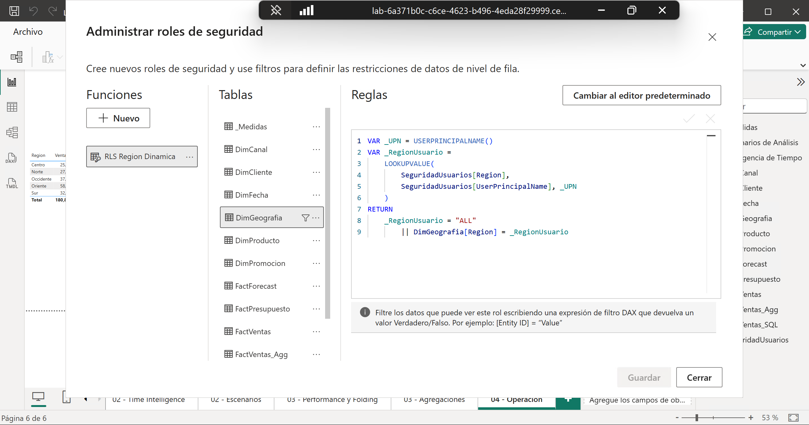
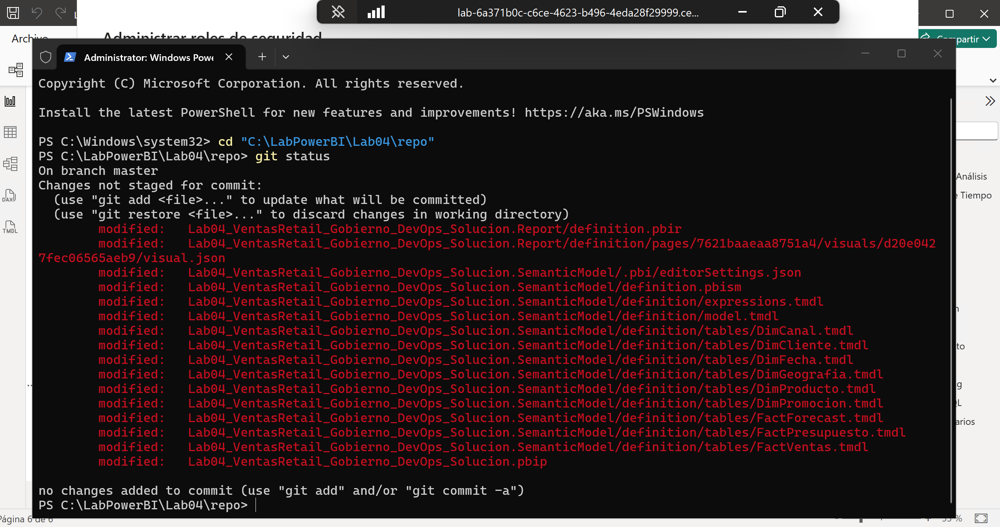
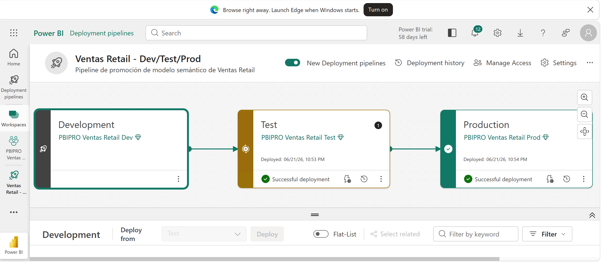
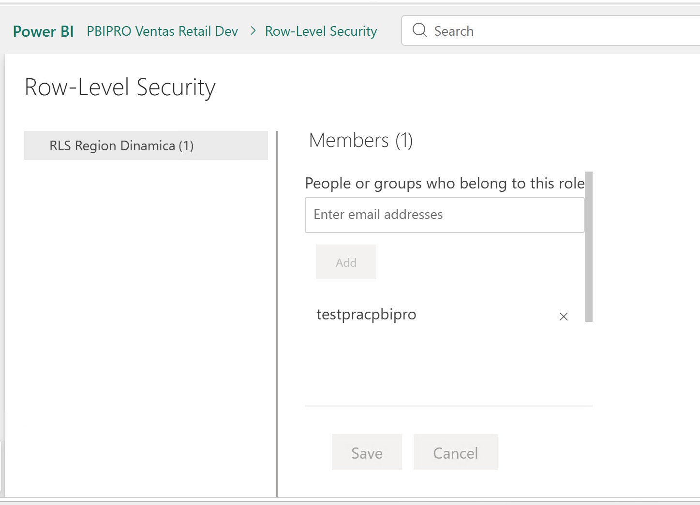
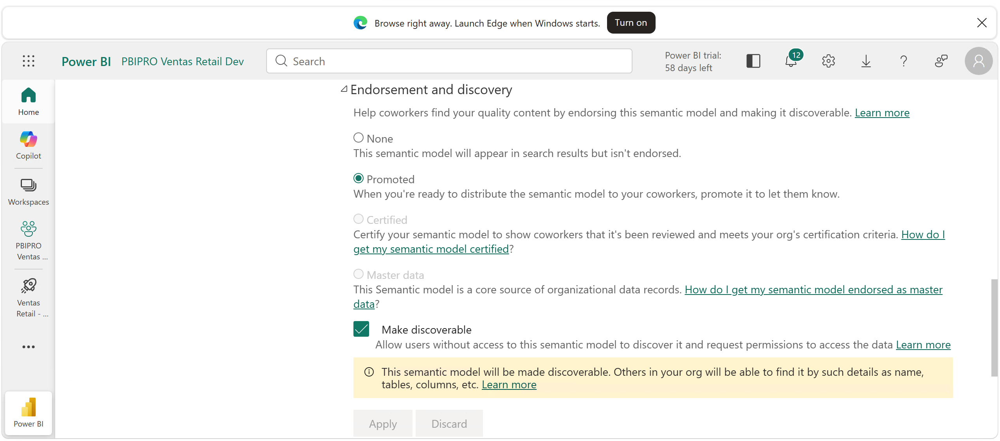
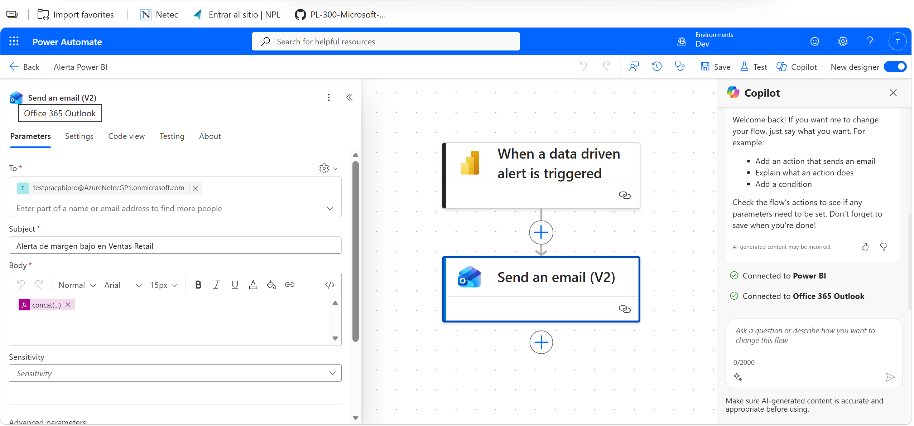

# Gobierno de Datos y Despliegue: Gestión del Ciclo de Vida Analítico

## 1. Metadatos

| Atributo | Valor |
|---|---|
| **Duración** | 75 minutos |
| **Complejidad** | Media-alta |
| **Nivel Bloom** | Aplicar / Crear |
| **Módulo** | Módulo 4 — DevOps Ligero & Ciclo de Vida |
| **Herramientas** | Power BI Desktop, Power BI Service, Git, Power Automate |
| **Archivo inicial** | `Lab03_VentasRetail_Performance.pbix` (copia de la salida de Cap03) |
| **Archivo final esperado** | `Lab04_VentasRetail_Gobierno_DevOps.pbix` |
| **Ruta principal** | Power BI Pro con workspaces Dev/Test/Prod manuales |
| **Ruta avanzada** | Deployment Pipelines si existe Fabric/Premium/PPU compatible |

---

## 2. Descripción General

En este laboratorio llevarás el modelo optimizado a un **flujo profesional de ciclo de vida**. La guía contempla dos realidades de aula y ambas cumplen el objetivo del capítulo:

- **Ruta A — Fabric/Premium/PPU disponible:** Deployment Pipelines para Dev/Test/Prod.
- **Ruta B — Solo Power BI Pro:** simula el ciclo con tres workspaces y una lista de control de promoción manual.

Además, parametrizarás el origen de los CSV, implementarás *Row-Level Security* dinámica por región, versionarás el modelo con Git, publicarás al servicio, documentarás gobierno y crearás una alerta operativa conectada a Power Automate.

---

## 3. Objetivos de Aprendizaje

Al finalizar este laboratorio serás capaz de:

- Preparar un flujo Dev/Test/Prod para un modelo Power BI.
- Parametrizar la ruta de los CSV para cambiar de entorno sin editar consultas.
- Implementar RLS dinámica por región con `USERPRINCIPALNAME()`.
- Versionar el modelo y su documentación con Git usando PBIP/TMDL o una exportación BIM.
- Publicar el modelo al Power BI Service.
- Crear una alerta operativa basada en una tarjeta/KPI de dashboard.
- Conectar una alerta a Power Automate.
- Documentar reglas de gobierno, sensibilidad y responsabilidades.

---

## 4. Insumos del laboratorio

| Insumo | Detalle |
|---|---|
| **Entrada** | `Lab03_VentasRetail_Performance.pbix` (salida de Cap03) |
| **Datos** | Los mismos CSV de `C:\LabPowerBI\AllFiles\` |
| **Herramientas** | Power BI Desktop, **Power BI Service** (cuenta Pro o PPU), Git, VS Code |
| **Servicio/extra** | Deployment Pipelines y Power Automate según el tenant (hay ruta alternativa) |
| **Salida** | `Lab04_VentasRetail_Gobierno_DevOps.pbix` + repositorio Git con documentación |

---

## 5. Contrato de continuidad del modelo

El archivo de entrada debe ser `Lab03_VentasRetail_Performance.pbix` y debe incluir:

| Objeto | Validación |
|---|---|
| Modelo base | Tablas de ventas, dimensiones, medidas base y de escenario. |
| Calculation Groups | `Inteligencia de Tiempo` y `Escenarios de Análisis`. |
| Performance | `Clientes Activos`, `Ventas Top Regiones`, `% Ventas vs Total`. |
| Agregaciones | `FactVentas_Agg` con grano `Mes × Producto × GeographyKey`, relaciones a `DimFecha`, `DimProducto` y `DimGeografia`, y medidas `Ventas Agg`, `Costo Agg`, `Unidades Agg`, `Margen % Agg`. |
| Incremental Refresh | Política configurada sobre `FactVentas`. |

---

## 6. Escenario del laboratorio

El modelo está listo para producción, pero hoy depende de una ruta de archivo fija, no tiene seguridad por usuario, no está versionado ni publicado, y nadie es notificado si el margen cae. Vas a cerrar todas esas brechas de gobierno y despliegue.

---

## 7. Instrucciones Paso a Paso

---

### Paso 0 — Preparar el archivo de inicio

**Objetivo:** crear la copia de trabajo del capítulo.

1. Copia `Lab03_VentasRetail_Performance.pbix` a `C:\LabPowerBI\Lab04\`.
2. Renómbralo como `Lab04_VentasRetail_Gobierno_DevOps.pbix`.

#### Resultado Esperado

- `Lab04_VentasRetail_Gobierno_DevOps.pbix` existe; el modelo abre sin errores.

---

### Paso 1 — Crear RLS dinámica por región

**Objetivo:** restringir datos por región usando `USERPRINCIPALNAME()`.

1. Selecciona **Inicio → Introducir datos** y crea la tabla `SeguridadUsuarios` con **todas** las regiones reales (`DimGeografia[Region]`: Centro, Norte, Occidente, Oriente, Sur):

   | UserPrincipalName | Region |
   |---|---|
   | instructor@dominio.com | ALL |
   | usuario.centro@dominio.com | Centro |
   | usuario.norte@dominio.com | Norte |
   | usuario.sur@dominio.com | Sur |
   | usuario.occidente@dominio.com | Occidente |
   | usuario.oriente@dominio.com | Oriente |

   >[!IMPORTANT] 
   > Ajusta los correos a los usuarios reales del laboratorio. Agregar el correo asignado por el instructor para realizar pruebas de RLS. con el mismo correo puedes probar distintos escenarios cambiando la región en la tabla `SeguridadUsuarios`. El correo del instructor debe tener asignada la región `ALL` para validar que ve todas las regiones.
   
   ```dax
   SeguridadUsuarios = DATATABLE(
       "UserPrincipalName", STRING,
       "Region", STRING,
       {
           {"instructor@dominio.com", "ALL"},
           {"usuario.centro@dominio.com", "Centro"},
           {"usuario.norte@dominio.com", "Norte"},
           {"usuario.sur@dominio.com", "Sur"},
           {"usuario.occidente@dominio.com", "Occidente"},
           {"usuario.oriente@dominio.com", "Oriente"}
       }
   )
   ```

2. **No** relaciones `SeguridadUsuarios` con el modelo; manténla como **tabla desconectada**.
3. En la vista de informe dar clic **Modelado → Administrar roles** y crea el rol `RLS Region Dinamica`.
4. En la tabla `DimGeografia`, aplica este filtro DAX:

   ```dax
   VAR _UPN = USERPRINCIPALNAME()
   VAR _RegionUsuario =
       LOOKUPVALUE(
           SeguridadUsuarios[Region],
           SeguridadUsuarios[UserPrincipalName], _UPN
       )
   RETURN
       _RegionUsuario = "ALL"
           || DimGeografia[Region] = _RegionUsuario
   ```

>[!NOTE]
> - Esta función DAX filtra `DimGeografia` según la región del usuario. Si el usuario tiene `ALL`, ve todas las regiones. `USERPRINCIPALNAME()` devuelve el correo del usuario conectado al servicio. En Power BI Desktop, devuelve el correo del usuario que abrió el PBIX. Para pruebas, usa los correos de la tabla `SeguridadUsuarios`. 

5. Dar clic en **Guardar** y luego, usa **Ver como** y prueba el rol con distintos usuarios.



#### Resultado Esperado

- Un usuario con región asignada ve solo su región; un usuario `ALL` ve todas. La geografía filtra ventas por la ruta `DimGeografia → DimCliente → FactVentas` y filtra agregaciones por `DimGeografia → FactVentas_Agg`.

---

### Paso 2 — Versionar modelo y documentación con Git

**Objetivo:** guardar el modelo en un formato versionable y agregar documentación de gobierno.

1. Crea la carpeta `C:\LabPowerBI\Lab04\repo`.

   Puedes crearla desde el Explorador de archivos o ejecutando en PowerShell:

   ```powershell
   New-Item -ItemType Directory -Path "C:\LabPowerBI\Lab04\repo" -Force
   ```

2. Guarda el modelo como **Power BI Project (.pbip)** dentro de esa carpeta (**Archivo → Guardar como → Power BI project**).

   Usa como ubicación:

   ```text
   C:\LabPowerBI\Lab04\repo
   ```

   Al guardar como **Power BI Project (.pbip)**, Power BI crea una estructura de archivos versionable, normalmente compuesta por un archivo `.pbip` y carpetas como `.Report` y `.SemanticModel`.

3. Abre PowerShell en la carpeta y ejecuta línea por línea, ajustando `user.name` y `user.email`:

   ```powershell
   cd "C:\LabPowerBI\Lab04\repo"
   git init
   git config user.name "Nombre del Alumno"
   git config user.email "correo@dominio.com"
   git status
   ```

   > Configura `user.name` y `user.email` aunque sea un repositorio local; sin estos valores, `git commit` puede fallar. Usa para `user.name` tu nombre real y para `user.email` el correo aportado por el instructor para la práctica.

4. Crea `README.md` del repositorio desde PowerShell ejecutando el siguiente bloque completo:

   ```powershell
   @'
   # Modelo Semántico - Ventas Retail

   ## Propósito
   Modelo Power BI para análisis de ventas, rentabilidad, escenarios, performance y gobierno.

   ## Entradas
   CSV parametrizados mediante `pRutaDatos`.

   ## Reglas clave
   - La geografía filtra ventas transaccionales por la ruta DimGeografia -> DimCliente -> FactVentas.
   - La geografía filtra FactVentas_Agg por la relación directa DimGeografia -> FactVentas_Agg, porque la agregación incluye GeographyKey.
   - Budget/Forecast solo aplican a Ventas y Unidades y tienen grano mensual.
   - La tabla agregada se usa para análisis de mes, producto y región.

   ## Responsable
   Equipo BI / Instructor del curso.
   '@ | Set-Content -Path ".\README.md" -Encoding UTF8
   ```

   Para validar que el archivo fue creado correctamente, ejecuta:

   ```powershell
   Get-Content ".\README.md"
   ```

5. Crea `DATA_DICTIONARY.md` con esta plantilla desde PowerShell ejecutando el siguiente bloque completo:

   ```powershell
   @'
   # Data Dictionary - Ventas Retail

   ## Tablas principales
   | Tabla | Tipo | Descripción | Sensibilidad |
   |---|---|---|---|
   | FactVentas | Hechos | Ventas transaccionales. | Confidencial - uso interno |
   | DimFecha | Dimensión | Calendario corporativo. | Pública interna |
   | DimProducto | Dimensión | Productos, categorías y marcas. | Pública interna |
   | DimCliente | Dimensión | Clientes y segmento. | Confidencial |
   | DimGeografia | Dimensión | País, región y ciudad. | Pública interna |
   | FactPresupuesto | Hechos | Presupuesto mensual. | Confidencial |
   | FactForecast | Hechos | Forecast mensual. | Confidencial |
   | FactVentas_Agg | Agregación | Ventas por mes, producto y GeographyKey. | Confidencial |

   ## Reglas de seguridad
   - RLS sobre DimGeografia[Region] usando USERPRINCIPALNAME().
   - FactVentas se filtra por DimGeografia -> DimCliente -> FactVentas.
   - FactVentas_Agg se filtra por DimGeografia -> FactVentas_Agg gracias a GeographyKey.
   - Usuarios sin región asignada no ven datos, salvo configuración ALL.

   ## Regla de granularidad
   - Budget y Forecast se encuentran a grano mensual. Las comparaciones contra Actual deben analizarse principalmente por fecha.

   ## Reglas de publicación
   - Dev: cambios en desarrollo. Test: validación. Prod: consumo final.
   '@ | Set-Content -Path ".\DATA_DICTIONARY.md" -Encoding UTF8
   ```

   Para validar que el archivo fue creado correctamente, ejecuta:

   ```powershell
   Get-Content ".\DATA_DICTIONARY.md"
   ```

6. Haz el commit inicial:

   ```powershell
   git add .
   git commit -m "chore: versionar modelo ventas retail y documentacion de gobierno"
   ```

   Luego valida el estado del repositorio:

   ```powershell
   git status
   ```

   El resultado esperado debe indicar que no hay cambios pendientes, por ejemplo:

   ```text
   nothing to commit, working tree clean
   ```



#### Resultado Esperado

* Existe un repositorio local con PBIP, `README.md` y `DATA_DICTIONARY.md`.
* El repositorio queda creado en `C:\LabPowerBI\Lab04\repo`.
* El modelo y la documentación quedan registrados en un commit inicial de Git.
* No se requiere Visual Studio Code ni otro editor adicional para crear los archivos de documentación.


---
### Paso 3 — Implementar el ciclo Dev/Test/Prod

**Objetivo:** publicar el modelo al servicio y ejecutar un ciclo de despliegue profesional.

1. Ingresar en `app.powerbi.com` e iniciar sesión (Usar correo y contraseña provista por el instructor).
2. Crear los siguientes workspaces con tipo workspace `Fabric Trial`:

   | Etapa | Workspace |
      |---|---|
      | Development | `PBIPRO Ventas Retail Dev` |
      | Test | `PBIPRO Ventas Retail Test` |
      | Production | `PBIPRO Ventas Retail Prod` |
 
3. En Power BI, en el menú lateral, selecciona **Deployment pipelines** y dar clic en **Nuevo pipeline**. Asigna `Ventas Retail - Dev/Test/Prod` como nombre del pipeline.
4. Agrega como descripción: `Pipeline de promoción de modelo semántico de Ventas Retail`.
5. Usa tres etapas: `Development → Test → Production` y dar clic en "Crear y continuar".
6. Asigna workspaces:

   | Etapa | Workspace |
   |---|---|
   | Development | `PBIPRO Ventas Retail Dev` |
   | Test | `PBIPRO Ventas Retail Test` |
   | Production | `PBIPRO Ventas Retail Prod` |

7. En Power BI Desktop, inicia sesión (Usar correo y contraseña provista por el instructor) y selecciona **Publicar**.
8. Publica en un workspace de desarrollo `PBIPRO Ventas Retail Dev`.
9. En el servicio, confirma que existen **Reporte** y **Modelo semántico**.
10. En el Pipeline, Despliega Dev → Test.
11. Configura reglas de parametro, en la etapa **Test**, dar clic en el botón del **Rayo**. Luego, en **Reglas de Parametro**, haz clic en **Agregar regla** y en la opción **From**, selecciona `RangeStart` y en la opción **To**, seleccionar la fecha que aparece. Realizar lo mismo para el parametro `RangeEnd`. Por último, haz clic en **Guardar** para aplicar las reglas de parámetro a la etapa de Test.

   >[!IMPORTANT]
   > - Las reglas de parámetro permiten que el mismo modelo apunte a diferentes orígenes de datos según la etapa del pipeline. En este caso, se configurarán para que en Test apunten a una ruta de archivos diferente a la de Dev, sin necesidad de editar las consultas M.
   
12. Despliega Test → Prod.
13. Revisa que el reporte y el modelo semántico estén disponibles en cada etapa del servicio.



#### Resultado Esperado

- El modelo se publica en el servicio y se despliega a través de las etapas Dev → Test → Prod con reglas de parámetro configuradas para cambiar RangeStart y RangeEnd.
- El servicio muestra el reporte y el modelo semántico en cada etapa.
- El pipeline refleja el estado de despliegue y las reglas de parámetro aplicadas.

---

### Paso 4 — Asignar y validar RLS en Power BI Service

**Objetivo:** aplicar en Power BI Service el rol RLS creado en Power BI Desktop, asignar usuarios al rol de seguridad y validar que el filtrado regional funciona correctamente en el servicio.

> En Power BI Desktop se definen los roles de RLS, pero los usuarios o grupos se asignan al rol desde Power BI Service.
> La validación en el servicio es obligatoria para confirmar que la seguridad funciona con el correo real del usuario conectado.

1. En Power BI Service, abre el workspace:

   ```text
   PBIPRO Ventas Retail Dev
   ```

2. Ubica el **modelo semántico** publicado.

3. En el modelo semántico, selecciona:

   ```text
   Más opciones (...) → Seguridad
   ```

4. Selecciona el rol:

   ```text
   RLS Region Dinamica
   ```

5. Agrega el usuario (correo electrónico suministrado por el instructor).

   Ejemplo:

   ```text
   usuario.norte@dominio.com
   ```
   >[!NOTE]
   > Asegúrate de usar el correo electrónico exacto proporcionado por el instructor. Puedes agregar a la tabla `SeguridadUsuarios` correos de los demás compañeros y asignarles regiones específicas para validar múltiples escenarios de RLS.

6. Guarda los cambios.

7. Abre el reporte y valida que los visuales solo muestran la región asignada al usuario.

>[!NOTE]
> Valida al menos los roles generados por otro compañero y confirma que alguien pueda ver la       configuración por una región específica.



#### Resultado Esperado

* El rol `RLS Region Dinamica` existe en Power BI Service.
* Al menos un usuario o grupo queda asignado al rol.
* La opción **Probar como rol** confirma que el reporte filtra datos por región.
* Un usuario con región específica ve solo su región.
* El usuario con región `ALL` ve todas las regiones.
* La validación queda realizada en el workspace correspondiente, especialmente en Prod si será el entorno de consumo final.

---
### Paso 5 — Descripción, endorsement y promoción del modelo

**Objetivo:** dejar el modelo descrito y recomendado para promoción/certificación.

1. En el servicio, abre la configuración del modelo semántico del workspace **PBIPRO Ventas Retail Dev** y agrega una descripción:

   ```text
   Modelo semántico de Ventas Retail para análisis de ventas, margen, escenarios
   Budget/Forecast, performance y gobierno. Fuente certificada del curso
   Ingeniería de Datos en Power BI Pro.
   ```

2. En el workspace **PBIPRO Ventas Retail Prod**, marca el contenido como **Promoted**. 

   >[!IMPORTANT]
   > - El endorsement (Promoted/Certified) es una señal de confianza y calidad del modelo. Promoted indica que el modelo es recomendado para uso (lo promueve el creador del informe), mientras que Certified implica que ha pasado por un proceso de validación más riguroso (Lo certifica un revisor autorizado o administrador).

3. En el pipeline despliega los cambios, principalmente la descripción del modelo semantico agregado en Dev.



#### Resultado Esperado

- El modelo en Dev tiene una descripción clara y el modelo en Prod está marcado como Promoted, indicando que es recomendado para su uso.

---

### Paso 6 — Crear alerta operativa y flujo Power Automate

**Objetivo:** demostrar monitoreo operativo por umbral.

1. En el reporte, en Power BI Service, crea una página `04 - Operacion` en el workspace Dev.
2. Agrega una tarjeta con esta medida:

   ```dax
   Margen Operativo % = [Margen %]
   ```
3. En el servicio, **fija la tarjeta a un dashboard** nuevo y nómbralo `Dashboard Operacion`.
4. En el *tile* del dashboard, selecciona **Manage alerts** y crea una alerta:

   | Propiedad | Valor sugerido |
   |---|---|
   | Nombre | `Alerta margen bajo` |
   | Condición | `Below` -> `Umbral` = 0.3 |
   | Frecuencia | Una vez por hora |
   | Notificación | Activada |

6. Abre **Power Automate**, selecciona el entorno llamado `Dev`
   >[!IMPORTANT]
   > Si el entorno no existe, crearlo con tipo "Desarrollador" para poder usarlo en este laboratorio. Si el tenant no permite crear entornos, documenta el diseño del flujo propuesto en el `README.md` del repositorio, describiendo el trigger y la acción sugerida.

7. Haz clic en **Crear** y crea un flujo de nube llamado `Alerta Power BI`.
8. Selecciona el trigger de Powe BI:

   ```text
   When a data driven alert is triggered
   ```
9. Configura el trigger iniciando sesión y en Alerta ID selecciona la alerta `Alerta margen bajo`.
10. Agrega una acción para enviar un correo a las partes interesadas:

    ```text
    Send an email (V2) - Outlook
    ```

    Configura el correo con:
      - Para: `<correo_asignado_por_instructor_para_pruebas>`
      - Asunto: `Alerta de margen bajo en Ventas Retail`
      - Cuerpo: Crear una función: `concat('El margen operativo ha caído por debajo de ', formatNumber(triggerOutputs()?['body/alertThreshold'], 'P2'), ' con un valor de ', formatNumber(triggerOutputs()?['body/tileValue'], 'P2'), '. Por favor revisar los gastos operativos y las ventas para identificar posibles causas.')`
      - Importancia: Alta

11. Dar clic en **Guardar** para activar el flujo. Luego, clic en **Test** -> `Automatically` → `Test` para validar que el flujo se ejecuta correctamente al activar la alerta. Revisa el correo de destino para confirmar que se recibió la notificación.

> **Nota:** las alertas de Power BI se crean sobre *tiles* de dashboard tipo card, KPI o gauge, no directamente sobre cualquier visual del reporte.



#### Resultado Esperado

- Alerta configurada sobre un tile de dashboard y flujo de Power Automate creado.
- Al activar la alerta, el flujo se ejecuta y envía un correo a las partes interesadas con la información del umbral y el valor actual.
---

### Paso 7 — Guardar la salida

1. Guarda el PBIX como `C:\LabPowerBI\Lab04\Lab04_VentasRetail_Gobierno_DevOps.pbix`. (sobrescribe el archivo).
2. Conserva el repositorio Git y el archivo PBIP (se usan en Cap05).
3. No elimines los workspaces (se usan en Cap05).

#### Resultado Esperado

- `Lab04_VentasRetail_Gobierno_DevOps.pbix` guardado, listo para ser la entrada del Capítulo 05.

---

## 8. Lista de verificación de completitud

| # | Verificación | Estado |
|---|---|--------|
| 1 | Parámetro `pRutaDato` controla las rutas de los CSV | ☐ |
| 2 | RLS dinámica por región implementada con `USERPRINCIPALNAME()` | ☐ |
| 3 | Repositorio Git creado con PBIP y documentación de gobierno | ☐ |
| 4 | Modelo publicado al servicio y desplegado Dev → Test → Prod | ☐ |
| 5 | Descripción del modelo agregada y marcado como Promoted | ☐ |
| 6 | Alerta operativa creada y conectada a flujo de Power Automate | ☐ |
| 7 | Archivo final guardado como `Lab04_VentasRetail_Gobierno_DevOps.pbix` | ☐ |

---

## 9. Cierre del laboratorio

**Encadenamiento:**

- **Entrada de este lab:** `Lab03_VentasRetail_Performance.pbix` (salida de Cap03).
- **Salida de este lab:** `C:\LabPowerBI\Lab04\Lab04_VentasRetail_Gobierno_DevOps.pbix` ← **entrada del Capítulo 05**.

### Lo que aprendiste en este laboratorio

1. **Ciclo de vida profesional:** cómo estructurar un flujo Dev/Test/Prod para modelos Power BI, con workspaces o Deployment Pipelines.
2. **Seguridad dinámica:** cómo implementar Row-Level Security por región usando `USERPRINCIPALNAME()`.
3. **Versionamiento con Git:** cómo guardar el modelo en formato PBIP para versionar con Git y agregar documentación de gobierno.
4. **Monitoreo operativo:** cómo crear alertas basadas en KPIs y conectarlas a Power Automate para notificaciones automáticas.

---

## 10. Recursos de referencia

| Recurso | URL |
|---|---|
| Deployment pipelines | https://learn.microsoft.com/fabric/cicd/deployment-pipelines/get-started-with-deployment-pipelines |
| Alertas de datos en Power BI | https://learn.microsoft.com/power-bi/create-reports/service-set-data-alerts |
| Power Automate con alertas de Power BI | https://learn.microsoft.com/power-bi/collaborate-share/office-integration/service-flow-integration |
| Row-Level Security | https://learn.microsoft.com/power-bi/enterprise/service-admin-rls |
| Power BI projects (PBIP) | https://learn.microsoft.com/power-bi/developer/projects/projects-overview |
| Gestión del ciclo de vida de contenido | https://learn.microsoft.com/power-bi/guidance/powerbi-implementation-planning-content-lifecycle-management-deploy |
