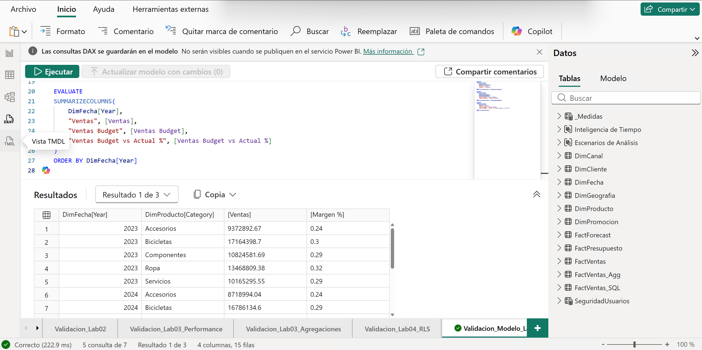
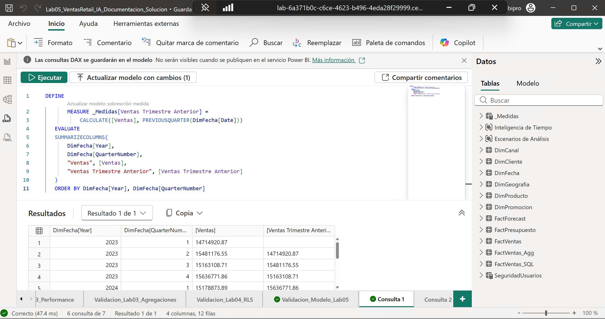
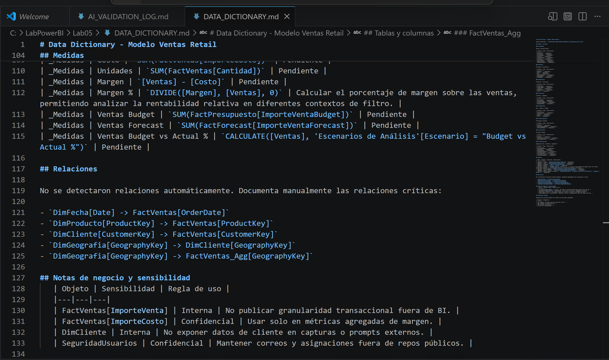
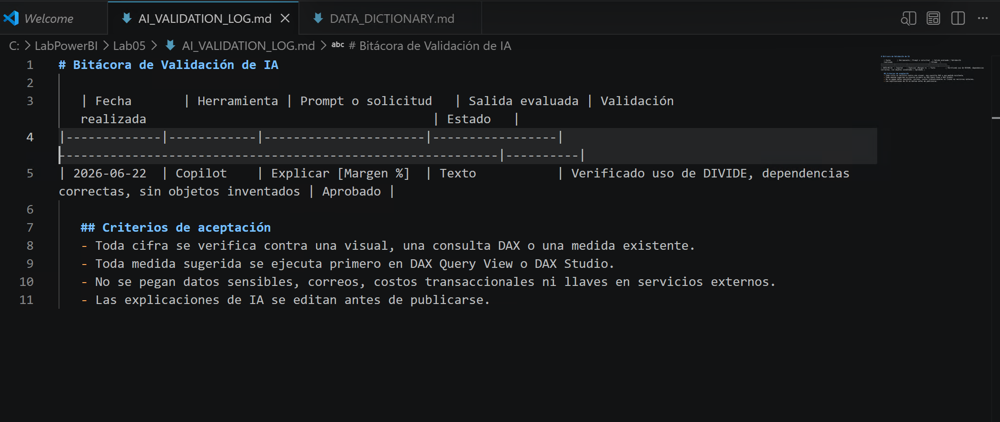
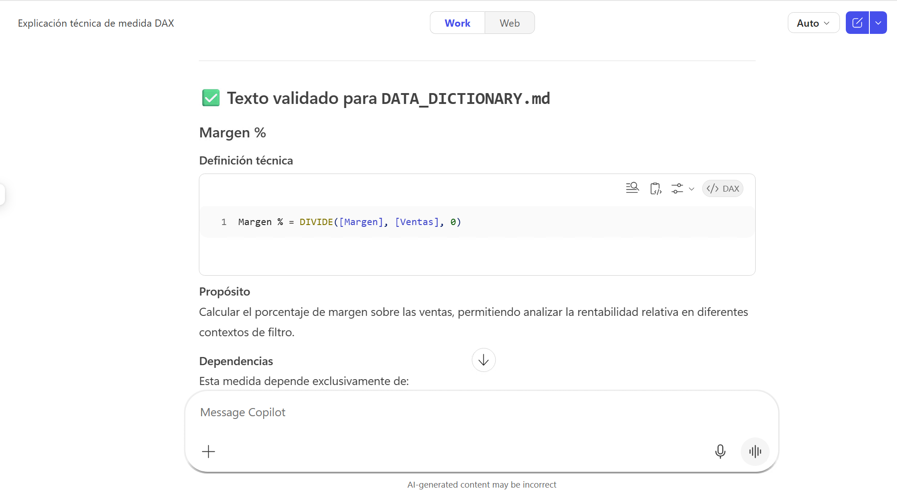
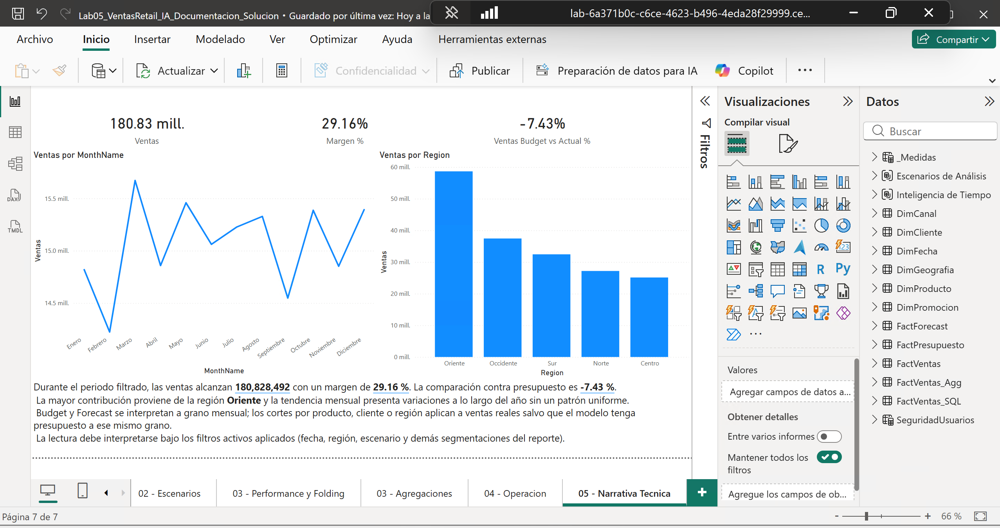

# Productividad Asistida por IA: Documentación Técnica y Generación de Insights

## 1. Metadatos

| Atributo | Valor |
|---|---|
| **Duración** | 75 minutos |
| **Complejidad** | Media |
| **Nivel Bloom** | Crear / Evaluar |
| **Módulo** | Módulo 5 — IA Aplicada & Documentación Técnica |
| **Herramientas** | Power BI Desktop, DAX Query View, Smart Narrative, Python, Markdown |
| **Archivo inicial** | `Lab04_VentasRetail_Gobierno_DevOps.pbix` (salida de Cap04) |
| **Archivo final esperado** | `Lab05_VentasRetail_IA_Documentacion.pbix` + documentación técnica |

---

## 2. Descripción General

En este laboratorio cerrarás el ciclo del taller produciendo **documentación técnica y narrativas verificables** a partir del modelo construido en los capítulos anteriores. El objetivo es que puedas generar artefactos de documentación que faciliten el mantenimiento, la evolución y la comprensión del modelo por parte de otros usuarios o desarrolladores, sin perder el control técnico ni arriesgar datos sensibles al usar IA.

---

## 3. Objetivos de Aprendizaje

Al finalizar este laboratorio serás capaz de:

- Usar DAX Query View o DAX Studio para validar medidas antes de incorporarlas al modelo.
- Generar un diccionario técnico de tablas, columnas, relaciones y medidas desde PBIP.
- Documentar medidas DAX con propósito, dependencias, granularidad y riesgos de interpretación.
- Crear una narrativa técnica con Smart Narrative y valores dinámicos.
- Usar IA generativa de forma segura, sin exponer datos sensibles.
- Construir un catálogo de prompts reutilizable.

---

## 4. Insumos del laboratorio

| Insumo | Detalle |
|---|---|
| **Entrada** | `Lab04_VentasRetail_Gobierno_DevOps.pbix` (salida de Cap04) |
| **Herramientas** | Power BI Desktop, DAX Query View, Smart Narrative, **Python 3.10+**, VS Code |
| **Script** | `Capitulo05/scripts/documentar_modelo.py` (incluido en el paquete) |
| **Opcional** | Copilot en Power BI (según tenant y capacidad) |
| **Salida** | `Lab05_VentasRetail_IA_Documentacion.pbix` + `DATA_DICTIONARY.md`, `AI_VALIDATION_LOG.md`, `PROMPTS_DAX.md` |

---

## 5. Contrato de continuidad del modelo

El archivo de inicio debe ser el resultado del Capítulo 04 y contener:

| Objeto | Validación esperada |
|---|---|
| Modelo base | `FactVentas`, `DimFecha`, `DimProducto`, `DimCliente`, `DimGeografia`, `DimCanal`, `DimPromocion`, `_Medidas`. |
| Escenarios | `FactPresupuesto`, `FactForecast`, medidas `[Ventas Budget]`, `[Ventas Forecast]`, `[Ventas Budget vs Actual %]`. |
| Calculation Groups | `Inteligencia de Tiempo` y `Escenarios de Análisis`. |
| Performance | Medidas de diagnóstico y `FactVentas_Agg`. |
| Gobierno | `pRutaDatos`, rol `RLS Region Dinamica`, publicación en servicio si el entorno lo permitió. |

Usa siempre los **nombres canónicos** (no cambies mayúsculas, espacios ni acentos). La referencia completa está en [`../MODELO_DATOS.md`](../MODELO_DATOS.md).

> `FactPresupuesto` y `FactForecast` tienen granularidad mensual. No valides Budget/Forecast por producto, cliente o región, salvo que documentes explícitamente la limitación.

---

## 6. Escenario del laboratorio

El modelo está optimizado, gobernado y publicado, pero falta lo que lo hace mantenible por otros: documentación técnica viva, narrativas que cualquiera pueda leer, y un proceso para usar IA sin arriesgar datos.

---

## 7. Instrucciones Paso a Paso

---

### Paso 0 — Preparar el archivo de inicio

**Objetivo:** crear la copia de trabajo y la carpeta del capítulo.

1. Crea `C:\LabPowerBI\Lab05\`.
2. Copia `C:\LabPowerBI\Lab04\Lab04_VentasRetail_Gobierno_DevOps.pbix` a `C:\LabPowerBI\Lab05\`.
3. Renómbralo como `Lab05_VentasRetail_IA_Documentacion`.
4. Crea una página `05 - Narrativa Tecnica`.
6. Copia el script `Capitulo05\scripts\documentar_modelo.py` de la guía de laboratorios a `C:\LabPowerBI\Lab05\scripts\`.

#### Resultado Esperado

- `Lab05_VentasRetail_IA_Documentacion.pbix` existe.
- `Lab05_VentasRetail_IA_Documentacion.pbix` está abierto, con la página creada y el script disponible.

---

### Paso 1 — Validar el modelo con DAX Query View

**Objetivo:** comprobar el modelo heredado separando validaciones por granularidad.

> No mezcles Budget/Forecast con producto, cliente o región en estas validaciones. Budget y Forecast están a grano mensual.

#### Validación A — Ventas reales por categoría

1. Abre **DAX Query View** y crea una consulta nueva.
2. Ejecuta:

```dax
EVALUATE
SUMMARIZECOLUMNS(
    DimFecha[Year],
    DimProducto[Category],
    "Ventas", [Ventas],
    "Margen %", [Margen %]
)
ORDER BY DimFecha[Year], DimProducto[Category]
```
>[!NOTE]
> Esta consulta valida que las medidas de ventas reales funcionan por año y categoría, sin mezclar presupuesto.

3. Verifica que devuelve filas por año y categoría.

#### Validación B — Budget y Forecast por fecha

Ejecuta una segunda consulta:

```dax
EVALUATE
SUMMARIZECOLUMNS(
    DimFecha[Year],
    DimFecha[MonthNumber],
    DimFecha[MonthName],
    "Ventas Budget", [Ventas Budget],
    "Ventas Forecast", [Ventas Forecast]
)
ORDER BY DimFecha[Year], DimFecha[MonthNumber]
```
>[!NOTE]
> Esta consulta valida que las medidas de presupuesto y forecast funcionan por año y mes, sin mezclar producto, cliente o región.

#### Validación C — Medida física de escenario

Ejecuta:

```dax
EVALUATE
SUMMARIZECOLUMNS(
    DimFecha[Year],
    "Ventas", [Ventas],
    "Ventas Budget", [Ventas Budget],
    "Ventas Budget vs Actual %", [Ventas Budget vs Actual %]
)
ORDER BY DimFecha[Year]
```

> `[Ventas Budget vs Actual %]` es la medida puente física. No uses `[Budget vs Actual %]`; ese nombre corresponde a un Calculation Item.



#### Resultado Esperado

- Ventas por categoría se validan sin mezclar presupuesto.
- Budget/Forecast se validan por fecha.
- `[Ventas Budget vs Actual %]` existe y devuelve resultados.

---

### Paso 2 — Crear y validar una medida nueva antes de incorporarla

**Objetivo:** usar DAX Query View como espacio seguro para probar una medida antes de crearla.

1. En DAX Query View, ejecuta:

   ```dax
   DEFINE
       MEASURE _Medidas[Ventas Trimestre Anterior] =
           CALCULATE([Ventas], PREVIOUSQUARTER(DimFecha[Date]))
   EVALUATE
   SUMMARIZECOLUMNS(
       DimFecha[Year],
       DimFecha[QuarterNumber],
       "Ventas", [Ventas],
       "Ventas Trimestre Anterior", [Ventas Trimestre Anterior]
   )
   ORDER BY DimFecha[Year], DimFecha[QuarterNumber]
   ```

2. Revisa que el primer trimestre disponible tenga el valor en blanco o cero, y que los siguientes muestren el trimestre previo.
3. Si es correcto, hacer clic en **Actualizar modelo con cambios** para crear la medida en el modelo.
4. Asigna formato de moneda y ubícala en la carpeta `Inteligencia de Tiempo`.



#### Resultado Esperado

- La medida queda en el modelo **solo después** de ser validada.

---

### Paso 3 — Guardar el modelo como PBIP

**Objetivo:** obtener metadatos legibles para la documentación técnica. Elige una ruta.

#### Ruta A — PBIP/TMDL desde Power BI Desktop

1. **Archivo → Guardar como → Power BI Project (.pbip)**.
2. Guarda en `C:\LabPowerBI\Lab05\Lab05_VentasRetail_IA_Documentacion_Project\`.
3. Verifica que existan archivos/carpetas de definición semántica (`definition`, `model.tmdl`, `tables` o archivos `.tmdl`).

#### Ruta B (Opcional) — BIM desde Tabular Editor

1. Con el PBIX abierto, ve a **Herramientas externas → Tabular Editor**.
2. **File → Save As** → `C:\LabPowerBI\Lab05\VentasRetail.bim`.
3. Ábrelo en VS Code y confirma que es JSON válido.

#### Resultado Esperado

- Tienes una fuente de metadatos documental: PBIP/TMDL **o** BIM.

---

### Paso 4 — Generar y validar el diccionario técnico del modelo

**Objetivo:** generar una primera versión del diccionario técnico desde metadatos locales del modelo y validar la documentación usando DAX Query View con funciones `INFO.VIEW.*`.

> En este paso se combinan dos enfoques:
>
> * **DAX Query View + INFO.VIEW.***: permite consultar metadatos reales del modelo desde Power BI Desktop.
> * **PBIP/TMDL o BIM + Python**: permite generar un archivo `DATA_DICTIONARY.md` estructurado, reutilizable y versionable.
>
> La extracción automática no reemplaza la revisión funcional del analista. Las descripciones, sensibilidad y reglas de negocio deben revisarse antes de entregar el laboratorio.

---

#### 4.1 Extraer metadatos desde DAX Query View

1. Abre **DAX Query View** en Power BI Desktop.

2. Ejecuta la siguiente consulta para revisar las tablas del modelo:

   ```dax
   EVALUATE
   SELECTCOLUMNS(
       INFO.VIEW.TABLES(),
       "Tabla", [Name],
       "Descripcion", [Description],
       "Modo almacenamiento", [StorageMode],
       "Categoria de datos", [DataCategory],
       "Tabla calculada DAX", [Expression],
       "Precedencia Calculation Group", [CalculationGroupPrecedence]
   )
   ORDER BY [Tabla]
   ```

3. Ejecuta la siguiente consulta para revisar las columnas visibles del modelo:

   ```dax
   EVALUATE
   SELECTCOLUMNS(
       FILTER(
           INFO.VIEW.COLUMNS(),
           [IsHidden] = FALSE()
       ),
       "Tabla", [Table],
       "Columna", [Name],
       "Tipo de dato", [DataType],
       "Categoria de datos", [DataCategory],
       "Descripcion", [Description],
       "Es clave", [IsKey],
       "Es unica", [IsUnique],
       "Permite nulos", [IsNullable],
       "Formato", [FormatString]
   )
   ORDER BY [Tabla], [Columna]
   ```

4. Ejecuta la siguiente consulta para revisar las medidas del modelo:

   ```dax
   EVALUATE
   SELECTCOLUMNS(
       INFO.VIEW.MEASURES(),
       "Tabla", [Table],
       "Medida", [Name],
       "Descripcion", [Description],
       "Expresion DAX", [Expression],
       "Formato", [FormatString],
       "Carpeta", [DisplayFolder],
       "Estado", [State]
   )
   ORDER BY [Tabla], [Medida]
   ```

   > Si la expresión DAX de una medida no aparece, valida que estés trabajando con permisos de edición sobre el modelo y no mediante una conexión limitada de solo lectura.

5. Ejecuta la siguiente consulta para revisar las relaciones del modelo:

   ```dax
   EVALUATE
   SELECTCOLUMNS(
       INFO.VIEW.RELATIONSHIPS(),
       "Relacion", [Relationship],
       "Activa", [IsActive],
       "Desde tabla", [FromTable],
       "Desde columna", [FromColumn],
       "Hacia tabla", [ToTable],
       "Hacia columna", [ToColumn],
       "Cardinalidad origen", [FromCardinality],
       "Cardinalidad destino", [ToCardinality],
       "Filtro cruzado", [CrossFilteringBehavior],
       "Filtro seguridad", [SecurityFilteringBehavior]
   )
   ORDER BY [Desde tabla], [Hacia tabla]
   ```

6. Verifica que aparezcan los objetos principales del modelo:

   * `FactVentas`
   * `DimFecha`
   * `DimProducto`
   * `DimCliente`
   * `DimGeografia`
   * `DimCanal`
   * `DimPromocion`
   * `FactPresupuesto`
   * `FactForecast`
   * `FactVentas_Agg`
   * `_Medidas`
---

#### 4.2 Generar el diccionario técnico con el script local

1. Abre una terminal en la carpeta del capítulo:

   ```powershell
   cd C:\LabPowerBI\Lab05
   ```

2. Ejecuta el script según la ruta utilizada.

   Si guardaste PBIP/TMDL:

   ```powershell
   python .\scripts\documentar_modelo.py --input "C:\LabPowerBI\Lab05\Lab05_VentasRetail_IA_Documentacion_Project" --out "C:\LabPowerBI\Lab05\DATA_DICTIONARY.md"
   ```

   Si exportaste BIM:

   ```powershell
   python .\scripts\documentar_modelo.py --input "C:\LabPowerBI\Lab05\VentasRetail.bim" --out "C:\LabPowerBI\Lab05\DATA_DICTIONARY.md"
   ```

3. Abre `DATA_DICTIONARY.md` en VS Code y revisa que incluya, según disponibilidad del modelo:

   * Tablas.
   * Columnas.
   * Relaciones.
   * Medidas.
   * Expresiones DAX.
   * Carpetas de visualización.
   * Descripciones existentes.

4. Usa los resultados obtenidos con `INFO.VIEW.*` para validar o completar el contenido generado en `DATA_DICTIONARY.md`.

5. Completa manualmente las descripciones pendientes, especialmente en objetos críticos como:

   * `FactVentas`
   * `FactPresupuesto`
   * `FactForecast`
   * `FactVentas_Agg`
   * `[Ventas]`
   * `[Margen %]`
   * `[Ventas Budget]`
   * `[Ventas Forecast]`
   * `[Ventas Budget vs Actual %]`

---

#### 4.3 Agregar notas de negocio y sensibilidad

Agrega una sección final en `DATA_DICTIONARY.md` llamada **Notas de negocio y sensibilidad**:

```markdown
## Notas de negocio y sensibilidad

| Objeto | Sensibilidad | Regla de uso |
|---|---|---|
| FactVentas[ImporteVenta] | Interna | No publicar granularidad transaccional fuera de BI. |
| FactVentas[ImporteCosto] | Confidencial | Usar solo en métricas agregadas de margen. |
| DimCliente | Interna | No exponer datos de cliente en capturas o prompts externos. |
| SeguridadUsuarios | Confidencial | Mantener correos y asignaciones fuera de repos públicos. |
| FactPresupuesto | Confidencial | Analizar principalmente por fecha debido a su grano mensual. |
| FactForecast | Confidencial | Analizar principalmente por fecha debido a su grano mensual. |
```


#### Resultado Esperado

* Existe `DATA_DICTIONARY.md` con tablas, columnas, relaciones, medidas y notas de gobierno.
* Existe `Validacion_Metadata_INFO_Lab05.dax` como evidencia de consulta de metadatos.
* El diccionario técnico se genera de forma estructurada con Python y se valida con metadatos reales desde DAX Query View.
* El alumno entiende que `INFO.VIEW.*` ayuda a documentar el modelo, pero la interpretación funcional y la clasificación de sensibilidad requieren revisión humana.

---

### Paso 5 — Crear la bitácora de validación de IA

**Objetivo:** documentar qué aportes fueron generados o sugeridos por IA y cómo se validaron.

1. Crea `C:\LabPowerBI\Lab05\AI_VALIDATION_LOG.md` con esta plantilla:

   ```markdown
   # Bitácora de Validación de IA

   | Fecha | Herramienta | Prompt o solicitud | Salida evaluada | Validación realizada | Estado |
   |---|---|---|---|---|---|
   | AAAA-MM-DD | DAX Query View / Copilot / LLM | Explicar [Margen %] | Texto | Comparado contra DAX y resultado | Aprobado / Ajustado / Rechazado |

   ## Criterios de aceptación
   - Toda cifra se verifica contra una visual, una consulta DAX o una medida existente.
   - Toda medida sugerida se ejecuta primero en DAX Query View o DAX Studio.
   - No se pegan datos sensibles, correos, costos transaccionales ni llaves en servicios externos.
   - Las explicaciones de IA se editan antes de publicarse.
   ```

2. Registra al menos dos filas reales durante este capítulo (una explicación de medida y una sugerencia de narrativa).



#### Resultado Esperado

- La entrega incluye trazabilidad sobre el uso de IA.

---

### Paso 6 — Usar IA como asistente opcional de explicación DAX

**Objetivo:** generar documentación más clara sin perder control técnico.

Usa Copilot chat (https://m365.cloud.microsoft/) e inicia sesión con la cuenta provista por el instructor.

1. Toma la medida `Margen % = DIVIDE([Margen], [Ventas], 0)`.
2. Usa este prompt **sin pegar datos sensibles**:

   ```text
   Actúa como revisor técnico de Power BI. Explica esta medida DAX en español para
   un diccionario de datos. Incluye: propósito, dependencias, comportamiento ante
   división por cero, granularidad esperada y riesgos de interpretación.
   No inventes columnas ni tablas que no estén en la expresión.

   Medida:
   Margen % = DIVIDE([Margen], [Ventas], 0)
   ```

3. Revisa la respuesta y corrige si menciona objetos inexistentes.
4. Copia la versión validada en `DATA_DICTIONARY.md`, debajo de la medida `Margen %`.
5. Registra el uso en `AI_VALIDATION_LOG.md`.



#### Resultado Esperado

- Al menos una medida queda documentada con explicación funcional validada.

---

### Paso 7 — Crear una narrativa técnica en Power BI con apoyo de Copilot Chat básico

**Objetivo:** comunicar insights del modelo usando visuales, valores dinámicos de Power BI y apoyo de Copilot Chat básico para mejorar la redacción técnica, sin depender de texto estático y sin usar Calculation Items como si fueran medidas físicas.

> En este laboratorio se usará **Copilot Chat básico** como apoyo externo para redactar y revisar la narrativa.
> La narrativa final se construirá dentro de Power BI mediante el visual **Smart Narrative** en **modo personalizado**, insertando valores dinámicos del modelo.
> No se asumirá disponibilidad de **Copilot para Power BI**, ya que esa capacidad depende de la licencia, tenant y configuración de capacidad de la organización.

1. Ve a la página `05 - Narrativa Tecnica` y agrega los siguientes visuales:

   | Visual            | Campos sugeridos                    | Nota                                   |
   | ----------------- | ----------------------------------- | -------------------------------------- |
   | Tarjeta           | `[Ventas]`                          | Actual bajo filtros activos.           |
   | Tarjeta           | `[Margen %]`                        | Formato porcentaje.                    |
   | Tarjeta           | `[Ventas Budget vs Actual %]`       | Medida física puente.                  |
   | Gráfico de líneas | `DimFecha[MonthName]` y `[Ventas]`  | Ordena por `DimFecha[MonthNumber]`.    |
   | Barras por región | `DimGeografia[Region]` y `[Ventas]` | Usa ventas reales, no Budget/Forecast. |

2. Revisa los valores mostrados en las tarjetas y registra manualmente los resultados principales en una breve bitácora de validación.

   Ejemplo:

   ```text
   Ventas: <valor observado>
   Margen %: <valor observado>
   Ventas Budget vs Actual %: <valor observado>
   Región con mayores ventas: <valor observado>
   Tendencia mensual observada: <creciente, decreciente o variable>
   Filtros activos: <fecha, región, escenario u otros filtros aplicados>
   ```

3. Abre **Copilot Chat básico** y solicita apoyo para redactar una narrativa técnica usando los valores observados.

   Usa un prompt similar al siguiente:

   ```text
   Actúa como analista senior de Power BI. 
   Redacta una narrativa técnica breve para una página de reporte de ventas retail.

   Usa estos resultados observados:
   - Ventas: <valor observado>
   - Margen %: <valor observado>
   - Ventas Budget vs Actual %: <valor observado>
   - Región con mayores ventas: <valor observado>
   - Tendencia mensual: <valor observado>
   - Filtros activos: <fecha, región, escenario u otros filtros>

   Reglas:
   - No inventes cifras.
   - No agregues conclusiones que no estén respaldadas por los datos entregados.
   - Explica que Budget y Forecast están a grano mensual.
   - Aclara que los cortes por producto, cliente o región aplican principalmente a ventas reales, salvo que el modelo tenga presupuesto a ese mismo grano.
   - Redacta en tono técnico, claro y ejecutivo.
   - Limita la respuesta a un máximo de 5 líneas.
   ```

4. Revisa la respuesta generada por Copilot Chat básico y valida cada afirmación contra los visuales de Power BI.

   Verifica especialmente:

   * Que las cifras coincidan con las tarjetas del reporte.
   * Que no se hayan inventado porcentajes, regiones o tendencias.
   * Que no se interprete Budget/Forecast a un grano que el modelo no tiene.
   * Que no se mencione `[Budget vs Actual %]` como si fuera una medida física.
   * Que la comparación contra presupuesto use la medida `[Ventas Budget vs Actual %]`.

5. Inserta un visual **Smart Narrative** en la página `05 - Narrativa Tecnica`.

6. Usa **modo personalizado** y redacta la narrativa final dentro de Power BI, usando como base la redacción validada con Copilot Chat básico.


7. Inserta valores dinámicos en el Smart Narrative para las siguientes medidas:
para crear valores dinámicos, escribe el texto normalmente y luego selecciona la parte que quieres convertir en valor dinámico, haz clic en el ícono de fx y elige la medida correspondiente.

   ```text
   [Ventas]
   [Margen %]
   [Ventas Budget vs Actual %]
   ```

8. Guarda el archivo como:

   ```text
   Lab05_VentasRetail_IA_Documentacion.pbix
   ```



#### Resultado Esperado

* La página comunica resultados mediante visuales y narrativa dinámica.
* Copilot Chat básico se usa como apoyo para redacción, no como fuente automática de cifras.
* La narrativa final se mantiene dentro de Power BI usando Smart Narrative y valores dinámicos.
* Las cifras se validan contra los visuales antes de publicar.
* La narrativa no referencia `[Budget vs Actual %]` como medida inexistente.
* La comparación contra presupuesto usa la medida física puente `[Ventas Budget vs Actual %]`.


---

### Paso 8 — Construir el catálogo de prompts reutilizable

**Objetivo:** dejar una herramienta práctica para futuros desarrollos.

1. Crea `C:\LabPowerBI\Lab05\PROMPTS_DAX.md` con este catálogo:

   ````markdown
   # Catálogo de Prompts DAX y Documentación Power BI

   ## 1. Explicar una medida
   ```text
   [Crea un prompt para explicar esta medida DAX, incluyendo propósito, dependencias, granularidad y riesgos de interpretación. No inventes objetos que no estén en la expresión.]
   ```

   ## 2. Refactorizar una medida
   ```text
   [Crea un prompt para sugerir mejoras o refactorizaciones a esta medida DAX, enfocándote en rendimiento, legibilidad o mejores prácticas. No asumas objetos que no estén en la expresión.]
   ```

   ## 3. Crear consulta de validación
   ```text
   [Crea un prompt para generar una consulta DAX que valide el resultado de esta medida contra los datos del modelo, sin asumir objetos que no estén en la expresión.]
   ```

   ## 4. Documentar una tabla
   ```text
   [Crea un prompt para generar una descripción técnica de esta tabla, incluyendo su propósito, granularidad, relaciones clave y cualquier consideración de sensibilidad o uso. No inventes columnas ni relaciones que no existan.]
   ```
   ````

#### Resultado Esperado

- Existe un archivo `PROMPTS_DAX.md` con prompts claros, reutilizables y clasificados por tipo de necesidad.
- Los prompts enfatizan la validación y el no asumir objetos inexistentes, para evitar respuestas de IA que no se ajusten al modelo real.

---

### Paso 9 — Paquete final de entrega

**Objetivo:** cerrar el taller con artefactos verificables.

1. Guarda el PBIX como `C:\LabPowerBI\Lab05\Lab05_VentasRetail_IA_Documentacion.pbix`.
2. Verifica que tienes estos archivos:

   | Archivo | Obligatorio | Evidencia |
   |---|---|---|
   | `Lab05_VentasRetail_IA_Documentacion.pbix` | Sí | Modelo final con página `05 - Narrativa Tecnica`. |
   | `DATA_DICTIONARY.md` | Sí | Diccionario técnico generado y revisado. |
   | `AI_VALIDATION_LOG.md` | Sí | Bitácora con al menos dos filas reales. |
   | `PROMPTS_DAX.md` | Sí | Catálogo de prompts reutilizables. |
   
#### Resultado Esperado

- Paquete final completo y verificable.

---
## 8. Lista de verificación de completitud

| # | Verificación | Estado |
|---|---|--------|
| 1 | `Lab05_VentasRetail_IA_Documentacion.pbix` abre sin errores | ☐ |
| 2 | Página `05 - Narrativa Tecnica` con KPIs, visuales y Smart Narrative | ☐ |
| 3 | `Ventas Trimestre Anterior` validada antes de agregarse | ☐ |
| 4 | `DATA_DICTIONARY.md` con tablas, relaciones, columnas y medidas | ☐ |
| 5 | `DATA_DICTIONARY.md` con notas de negocio y sensibilidad | ☐ |
| 6 | `AI_VALIDATION_LOG.md` con al menos dos usos de IA | ☐ |
| 7 | `PROMPTS_DAX.md` con prompts clasificados | ☐ |
| 8 | Ningún prompt externo contiene datos sensibles | ☐ |
| 9 | Cifras narrativas verificadas contra el modelo | ☐ |

---

## 9. Cierre del laboratorio

**Encadenamiento:**

- **Entrada de este lab:** `Lab04_VentasRetail_Gobierno_DevOps.pbix` (salida de Cap04).
- **Salida final del curso:** `C:\LabPowerBI\Lab05\Lab05_VentasRetail_IA_Documentacion.pbix` + documentación técnica.

---

## 10. Recursos de referencia

| Recurso | URL |
|---|---|
| DAX Query View | https://learn.microsoft.com/power-bi/transform-model/dax-query-view |
| Smart Narrative | https://learn.microsoft.com/power-bi/visuals/power-bi-visualization-smart-narrative |
| Copilot en Power BI | https://learn.microsoft.com/power-bi/create-reports/copilot-introduction |
| Power BI projects (PBIP) | https://learn.microsoft.com/power-bi/developer/projects/projects-overview |
| TMDL (Tabular Model Definition Language) | https://learn.microsoft.com/analysis-services/tmdl/tmdl-overview |
